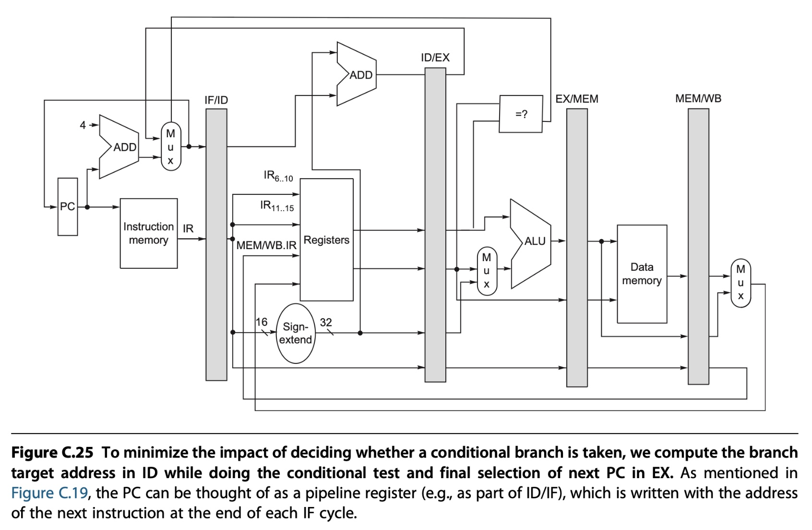

# Pipelining: Basic and Intermediate Concepts

## Introduction

### What Is Pipelining?

> 📗Pipelining is an implementation technique whereby multiple instructions are overlapped in execution; it takes advantage of parallelism that exists among the actions needed to execute an instruction. 

* throughput
* processor cycle (determined by the time required for the slowest pipe stage, almost always 1 clock cycle)

### RISC V Instruction Set


Instruction fetch cycle (IF)

⬇️

Instruction decode/register fetch cycle (ID)

⬇️

Execution/effective address cycle (EX)

⬇️

Memory access (MEM)

⬇️

Write-back cycle (WB)

In this implementation:
* branch instructions require three cycles
* store instructions require four cycles
* all other instructions require five cycles


Ensure no conflicts:
*  Goodness
   *  separate instruction and data memories
   *  register file is used in the two stages: one for reading in ID and one for writing in WB
*  Badness
   *  does not deal with the PC (IF stage increment and store the PC)
   *  need to have an adder (ID stage compute the potential branch target address)
   *  need ALU (ALU stage evaluate the branch condition)


📗pipeline registers: at the end of a clock cycle all the results from a given stage are stored into a register that is used as the input to the next stage on the next clock cycle.


naming the pipeline registers: IF/ID, ID/EX, EX/MEM, and MEM/WB

Pipeline overhead: pipeline register delay & clock skew

## Pipeline Hazards

three classes of hazards:
* Structural hazards
  * 📗resource conflicts when the hardware cannot support all possible combinations of instructions simultaneously in overlapped execution
* Data hazards
  * 📗an instruction depends on the results of a previous instruction
* Control hazards
  * 📗the pipelining of branches and other instructions that change the PC


hazards -> stall

### Data hazards

three types of hazards:
* Read After Write (RAW) hazard (注意它们的定义，字面上是本应该如此的意思)
* Write After Read (WAR) hazard
* Write After Write (WAW) hazard

check ch3 for more info about data dependence, here only discuss RAW Issues

```assembly
add x1,x2,x3
sub x4,x1,x5
and x6,x1,x7
or  x8,x1,x9
xor x10,x1,x11
```


Minimizing Data Hazard Stalls by Forwarding (also called bypassing and sometimes short-circuiting) ⬇️


---

不是所有的代码都如此幸运，可以通过forwarding解决，下面这段代码就只能stall了...

```assembly
ld   x1,0(x2)
sub  x4,x1,x5
and  x6,x1,x7
or   x8,x1,x9
```


📗pipeline interlock (hardware support): detects a hazard and stalls the pipeline until the hazard is cleared.

### Branch Hazards


📗the branch instruction decides whether to branch in the MEM stage -> 3-cycle stall

⬇️

use **forwarding** after EXE phase -> 2-cycle stall

⬇️

compare the two registers read during the ID stage -> 1-cycle stall


For more information, check the textbook *Computer organization and design: The hardware / software interface* p318.

从上面这本书中抠了一张图，方便理解：


---

How to deal with branch instructions?

**Method1: freeze or flush the pipeline**


👧Actually, I think if the second IF doesn't appear, then it will be more close to the meaning of "freeze".

**Method2: treat every branch as not taken**

**Method3: predicted-not-taken or predicted-untaken scheme**


**Method4: treat every branch as taken**


👧I felt really confusing when I saw these 4 methods, that's beacuse I thought method 2&4 are the same as method 3. After reading multiple times of the materials, I realized the subtle difference, "predict" is not the same as "always". When it's always like a fix pattern, then the compiler can optimize the codes and organize them in a better way. That's the difference.


ℹ️Method4 is adopted in early RISC processors, also named as **delayed branch**. Introduce a concept **branch delay slot**. But this method is replaced by **dynamic branch prediction** in RISC V's design.

### Branch Prediction

* Static Branch Prediction
  * use profile information collected from earlier runs
* Dynamic Branch prediction
  * branch-prediction buffer or branch history table (indexed by the lower portion of the address of the branch instruction)
  * 1-bit prediction schemes -> 2-bit prediction schemes (avoid the badness of flipping bits)


## How Is Pipelining Implemented?

你只需要搞透这张图：


进化版：



👧实践是检验真理的唯一标准！在Minisys板子上写个CPU啥都整明白了...

## What Makes Pipelining Hard to Implement?

* Dealing With Exceptions
* Instruction Set Complications

## Extending the RISC V Integer Pipeline to Handle Multicycle Operations

To support floating-point operations


📗Assuming that the pipeline does all hazard detection in ID, there are three checks that must be performed before an instruction can issue:
* Check for structural hazards
* Check for a RAW data hazard
* Check for a WAW data hazard


Maintaining Precise Exceptions -> out-of-order problem
*  ignore the problem and settle for imprecise exceptions
*  buffer the results of an operation until all the operations that were issued earlier are complete
*  allow the exceptions to become somewhat imprecise, but to keep enough information so that the trap-handling routines can create a precise sequence for the exception
*  a hybrid scheme that allows the instruction issue to continue only if it is certain that all the instructions before the issuing instruction will complete without causing an exception

## Putting It All Together: The MIPS R4000 Pipeline


* superpipelining -> five-stage integer pipeline into eight stages
  *  increase in stalls for loads and branches
  *  increases the number of levels of forwarding for ALU operations
  *  increases the FP result stalls and FP structural stalls


后面几节整理的不好，比较粗的看书，再加上大半夜的...我还是快去睡觉吧 QAQ