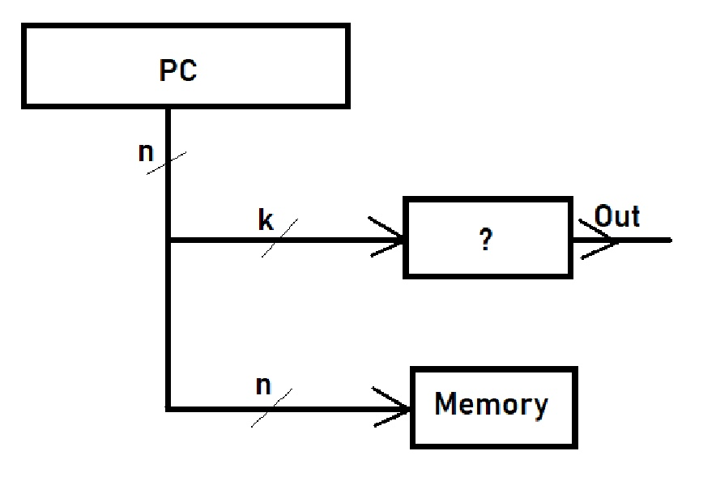
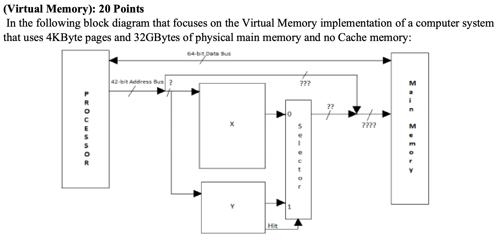

前言：大概率最后一次更新了。期中考试那会由于老师让我们自己改卷子，那天花费了一下午搞得精疲力竭（关于如何评分）所以当时没有做 review。期末考试考完大把的时间，本着有始有终的态度，以这篇 final review 作为这门课的终结。

---

开门红。。。第一题就被打了叉叉："Superscalar and SMT architectures are basically the same except for the fact that Superscalars need more hardware compared to SMT’s." 审题不仔细，重点在于后面的 hardware 比较错位，我只反驳了前半句话。

---

第二道大题开始就懵了，题型挺出人意外的。。猜猜这里的问号是什么？

我填了 Branch History Table 考完试看到 Discord 里大家讨论是不是 BTB 的时候，我慌了。。看起来 BTB 好像更符合 general cases？

答案是：

> This can be Branch History Table (BHT that stores the behavior of the program instructions and especially branches in the program). 
> 
> It can NOT be Branch Target Buffer (BTB which holds not only the prediction bits but also the destination address) because for BTB all bits of PC should be fed to BTB for comparison purposes.

看来我误打误撞对了，Branch Target Buffer 为了保证准确性，需要传入 n bits。

> What is the relationship between n and k (if any) and typical values for n and k in a typical processor? Please elaborate. (3 Pts)

答案是：

> There is no direct relationship but for sure `k<<n` ! Typical values of n are 32 and 64 in current processors and k is around 10 to 16.

我在答案里写 n=32， k在10到14之间。感谢老师不扣分之恩。不过出这种题也是@#¥#¥%吧，谁会记住这玩意儿？

---

第三题是作业中出现过的：

> What is the bottleneck in the following system setup: the CPU, memory sub-system, or the I/O sub- system?

然后 balabala 给出一堆数据，但比较坑的是这题分两小问，第一问：

> Assume each 128KB block is randomly distributed across the surfaces of all disks’ platters.

第二问：

> Assume all needed 128KB blocks for this program are located on consecutive sectors on the same cylinder

答案：

> Everything is the same as parta for the processor and Memory sub-system. The new I/O subsystem latancy will be less by the average seek time as the seek is needed for the first time only and will not get repeated afterwards.

呃，我 less by rotation time ... 再次盯一会 Disk 那张图！无解。。去网上找了一张更清楚的图：

图片来自 [Hard Drives: How Do They Work? – Techbytes](https://blogs.umass.edu/Techbytes/2017/04/04/hard-drives-how-do-they-work/)

网上查到的资料说磁盘数据的读写是以 sector 为单位的，我就把它理解成按照紫色的那块区域一点一点写 🤦‍♀️ 现在想想太幼稚，这样写的成本明显比一圈一圈写高。所以所谓的 consecutive sectors 指的是圆环状的一圈，而不是那个扇形。

理解清楚这一点后，很容易分析出 rotation time 依然存在，但 seek time 忽略不计。

---

第四题比第二题还要令人懵逼：

每个小问环环相扣，要是第一问没答对，后面几问也会出问题。第一问是上图中的各种问号表示多少 bits？

不过要搞清楚这个问题，还是得先回答第二题：x 和 y 是什么？这题难度还算中等，x 是 page table，y 是 TLB，但我又一次大意，漏了还需要指明 x 和 y 的位置。。。x 在 memmory 中，y 在 CPU 中，这 2 分真不值 😭

了解了 x 和 y 分别是什么后，很容易能分析出 `?` 表示 Virtual Page Number (VPN)，`??` 表示 Physical Page Number (PPN)，`???` 表示 Offset，`????` 表示 PPN + Offset，也就是 physical memory 基于 byte 取址的索引 bits 数。

`????` 最好求了，已经给出 physical memory 为 32 GBytes，32 GBytes = 2^35 Bytes，所以 `???? = 35`；

4 KBytes = 2^12 Bytes，所以 `??? = 12`；

由于 `???? = ??? + ??`，所以 `?? = 35 - 12 = 23`；

**Virtual Address 是 42 bits 的！** 所以 `? = 42 - 12 = 30`。我又一次大意直接带入习惯了的 32 bits 来算。。。🤦‍♀️ 

第三问：

> Calculate/guess! the number of entries and the size of each entry in the X block and show the data elements (along with their sizes in bits) in each entry on the following figure, as accurately as you can. (5 Pts)

答案为：

> PPN (23 bits) | Valid (1 bit) | Dirty (1 bit) | Access Rights (2 bits)

注意 Access Rights 是不止 1 bit 的，考试时时间太紧想都没想无脑填。现在想想 file 的读写权限光 RWX 就不只 2 个选项了。课件上写的是 `No_access, Read_only, Execute_only, RW&Execute` 共 4 种选择，所以需要 2 bits。另外注意 Page Table 是按照 VPN 排列的，所以不需要 VPN。

第四问：

> Repeat part c for the Y block. (5 Pts)

答案为：

> VPN (30 bits | PPN (23 bits) | Valid (1 bit) | Dirty (1 bit) | Access Rights (2 bits)

总结：其实这道题事后回顾一下，并没有想象中那么可怕。但是考试紧张的氛围，凌晨四五点的精神状态，时间的紧迫感，很容易出现不必要的小错误。我考试的时候在做第二题就有点心慌慌，第四题又出了一个结构图挖空题，还没做就有点认输了。。。所以心态真的很重要！稳才能不乱。

---

第五题是 Tomasulo with ROB，我第一次做到这么简单的 Tomasulo Algorithm，这里就不分析了。考前还重点训练和总结了一下 Tomasulo Algorithm 的各种坑点，没想到一！个！都！没！遇！到！😔

---

第六题是最后一题，包含 10 分的 bonus。我虽然做了 bonus 但一分没拿 😂

第一问：

> Consider a 1 Mbytes 16-way set-associative cache with 16-word blocks (Each word is 4 bytes). The CPU produces 64-bit physical byte addresses. Calculate the number of bits in the Tag, Index, and Offset for this Cache system. (10 Pts)

答案：

> Block size = 16 * 4 = 64 bytes => Offset bits = log2(64) = 6
> 
> 16-way set associative organization => line size 16 * 64 = 2^20 = 1K Bytes
> 
> `#` of lines = Total size / line size = 1M/1K = 1K = 1024 lines => Index bits = log2(1024) = 10 Bits 
> 
> `#` of Tag bits = 64 – (10 + 6) = 48 Bits

考试时不知道改了多少次这题，最后终于把逻辑给整通了 😄 主要存在的问题是对 cache 各部分，也就是 Tag, index 和 Offset 理解不够到位。

第二问：

> Assuming a “write Back” strategy and one LRU bit per 2-way, calculate the size of the control part of each line of the cache and from there calculate the total number of bits in the cache (for both control and data). (10 Pts)

答案：

> Total # of control bits /line = 16 Dirty Bits + 8 LRU Bits + 16 Valid Bits + 16 * 48 Tag bits = 808 Bits
> 
> Total # of data bits /line =16 * 64 * 8 = 2^13= 8kbits = 8192 
> 
> Total # of bits per line = 9000 bits
> 
> Total size of Cache in bits = 9000 * 1024 = 9216000 Bits

考试时这题我不会做，有两点疑问：一是对 control bits 的理解，不过根据这个答案，应该除了 data 外的都算 control，包括 tag bits；二是没想明白 `each line of cache` 中 `control part` 是怎么样的，考试时我脑子里的 16-way 就算是同一个 set 也是一列一列排下来，陷入这样想法的死胡同里，这道题怎么做怎么奇怪。实际上，同一个 set 的 cache line 按照行排列，题目中的 `each line of cache` 指的是一整个 set。

最后一问：

> The average memory access time for the CPU with 1 level of cache is 2.4 clock cycles. If data is present and valid in the cache, it can be found in 1 clock cycle. If data is not found in the cache, 80 clock cycles are needed to get it from off-chip memory.
> 
> Designers are trying to improve the average memory access time to obtain a 40% improvement in average memory access time and are considering adding a 2nd level of cache on-chip. This second level of cache could be accessed in 8 clock cycles. The addition of this cache does not affect the first level cache’s access patterns or hit times. Off-chip accesses would now require 100 additional clock cycles. To obtain the desired improvement, what should be the hit rate in the 2nd level cache? (10 Pts – 568 Bonus)

答案：

> 2.4 = 1 + Miss RateL1 * 80 => Miss RateL1 = 1.4/80=0.0175 = 1.75%
> 
> Required AMAT = (1-0.40) * 2.4 = 1.44
> 
> So:
> 1.44 = 1 + 0.0175 (8 + MissRateL2 * 100) => (8 + MissRateL2 * 100) = 25.14  => MissrateL2 = 0.1714 => Hit rate L2= 0.8286 = 82.86%

呃，原来是弄错了数据含义。`The average memory access time` 暗示了我有多蠢。。开头几个单词没看清楚就拿起数据写写写。。。不过也在情理之中，考试只剩下最后五分钟了 🤦‍♀️

---

后记：

期末考成绩还算凑合，虽然和期中考的差不多，但是期末考粗心点更多，犯了一堆不该犯的错总是比因为难错让人 😫

记忆中这是我第一次好好地分析总结期末考试，非常感谢 Yadi Eslami 老师分发了电子版的答案以及对卷子的评分情况，以前老师都不愿意公开答案，好一点的老师也就在改完卷子后抽出一个下午的时间可以去对答案，一般这个时候我已经处以放寒假呆在老家的阶段了 🤦‍♀️ 所以在以往的认知中，期末考试考完我就和这门课 say goodbye 了，有的卷子特难，但最终我也没有去寻找它们的答案。前几天看到一个叫 `Knowledge Debt` 的概念，用在这里也还算合适，那些本应该去弄懂但却被搁置的问题，像是我身上的债务一样，越欠越多，最终让我停滞不前。当然，把没弄明白的期末卷子看作自己的 `Knowledge Debt` 有点过于夸张。但对于我来说，我还是希望学习一门课是从头坚持到尾的。

最后，感谢 Yadi Eslami 老师给我们上的这门课，虽然我老是抱怨一周本来 2 课时变成 4 课时耗费了太多的时间，但是老师抽出时间备课录屏也很不容易；这门课没有 TA，老师还带了其他课程，估计问他问题的不在少数，大量的邮件轰炸工作量非常大，但老师依然及时地回复我邮件还是特别感动。感谢 Steven，在小组合作的 project 中发挥着重要作用，虽然刚开始的算法是我写的，但后期我基本没参与，队友太靠谱啦 😁；另外我拜托了他好几次在 discussion 课问老师问题（时差问题我只看录屏），每次结束他都会告诉我老师的反馈，太感激了！感谢 Jin，论有一个能一起讨论作业 quiz 的同学有多重要！感谢 GitHub（喵喵喵？），要是没有一个公开的平台，也许我记着记着就放弃了 😅 尽管没啥人看我的笔记，但是由于它是公开的，感觉自己多了一份承诺和责任。再次印证了我这段时间的思考：像我这种人呐（没毅力重度拖延），就不能给太多自由，一自由就容易颓废，多找些规则限制限制自己，不要担心把自己逼太紧了，因为一松起来简直是¥%……&