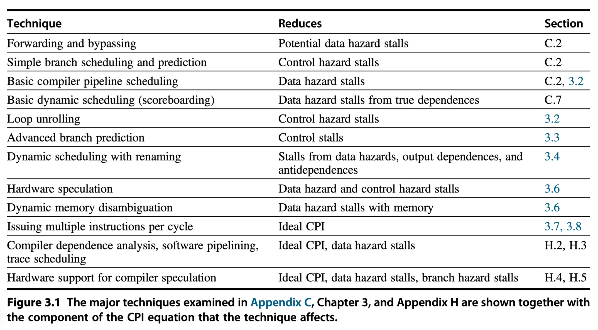

# ch1: Instruction-Level Parallelism and Its Exploitation

## instruction-level parallelism (ILP)

1. relies on hardware to help discover and exploit the parallelism dynamically
2. relies on software technology to find parallelism statically at compile time

👧In reality, the first approach is more mature and dominates the markets.  Intel Itanium series, introduced in 1999, have explored the second apporach but the results are not so good and only apply for domain-specific environments.

---

Pipeline CPI = Ideal pipeline CPI + Structural stalls + Data hazard stalls + Control stalls

👧From the following table, we can understand the technology influence on CPI.

---

**Instruction-Level Parallelism** VS **parallelism within a basic block**

loop-level parallelism -> Instruction-Level Parallelism
* unrolling the loop either statically by the compiler (Sections 3.2)
* dynamically by the hardware (Sections 3.5+3.6)
* use of SIMD in both vector processors and graphics processing units (GPUs) (Chapter 4)

### Data Dependences

Two types:
* Instruction i produces a result that may be used by instruction j.
* Instruction j is data-dependent on instruction k, and instruction k is data- dependent on instruction i.

Note that a dependence within a single instruction (such as add x1,x1,x1) is not considered a dependence.

📗pipeline interlocks: A hardware that can detect a hazard and stalls the pipeline until the hazard is cleared.

---

Three things need to discover:
* (1) the possibility of a hazard
* (2) the order in which results must be calculated
* (3) an upper bound on how much parallelism can possibly be exploited

---

How to overcome it?
*  (1) maintaining the dependence but avoiding a hazard
*  (2) eliminating a dependence by transforming the code

Major method: scheduling without altering a dependence (both hardware and compiler)

---

A data can come from registers and memory locations. The former one is easy to handle since the names of registers are fixed, while the latter one is hard.

### Name Dependences

📗Definition: A name dependence occurs when two instructions use the same register or memory location, called a name, but there is no flow of data between the instructions associated with that name.

Two types:
1. An **antidependence** between instruction i and instruction j occurs when instruction j writes a register or memory location that instruction i reads. The original ordering must be preserved to ensure that i reads the correct value. (WAR)
2. An **output dependence** occurs when instruction i and instruction j write the same register or memory location. The **ordering** between the instructions must be preserved to ensure that the value finally written corresponds to instruction j. (WAW)

If the data is from registers, we can use **renaming** mechanism.

---

Conclusion: data hazards happen when there is a name or data dependence between instructions. 

### Control Dependences

two constraints:
1. An instruction that is control-dependent on a branch cannot be moved before the branch so that its execution is no longer controlled by the branch.
2. An instruction that is not control-dependent on a branch cannot be moved after the branch so that its execution is controlled by the branch.

Control dependence is not the critical property that must be preserved. => **exception behavior** + the **data flow**

handling exception behavior:
* ignore the exception when the branch is taken
* speculation 
  * hardware (Section 3.6)
  * software techniques (Appendix H)

## Basic Compiler Techniques

### Basic Pipeline Scheduling and Loop Unrolling

👧static issue or static scheduling: static for compiler and dynamic for hardware.

📗A compiler’s ability to perform this scheduling depends both on **the amount of ILP available in the program** and on **the latencies of the functional units** in the pipeline.

Examples of scheduling: see p178 (my pdf viewer p210)

📗loop unrolling: simply replicates the loop body multiple times, adjusting the loop termination code

Extra work for unrolling:
* increases the required number of registers
* requires symbolic substitution and simplification
* two consecutive loops (similar to **strip mining**)
  * n mod k (original loop)
  * n / k (unrolled loop)

Examples of unrolling: see p179 (my pdf viewer p211)

Limits of unrolling:
* a decrease in the amount of overhead amortized with each unroll
* code size limitations (miss rate up)
* compiler limitations (register pressure)

## Advanced Branch Prediction

📗In Appendix C, we examine simple branch predictors that rely either on **compile-time information** or on the **observed dynamic behavior** of a single branch in isolation.

### Correlating Branch Predictors

📗correlating predictors or two-level predictors: branch predictors that use the behavior of other branches to make a prediction.

📗In the general case, an (m,n) predictor uses the behavior of the last m branches to choose from 2^m branch predictors, each of which is an n-bit predictor for a single branch.

=> like a hash map

### Tournament Predictors: Adaptively Combining Local and Global Predictors

## Dynamic Scheduling

## Hardware-Based Speculation

## 