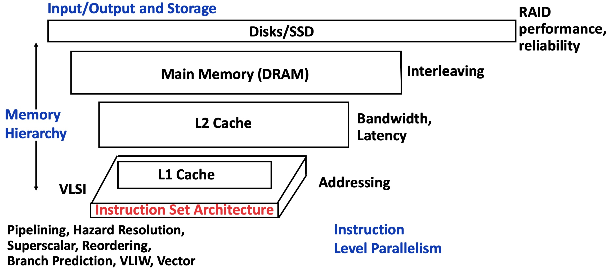
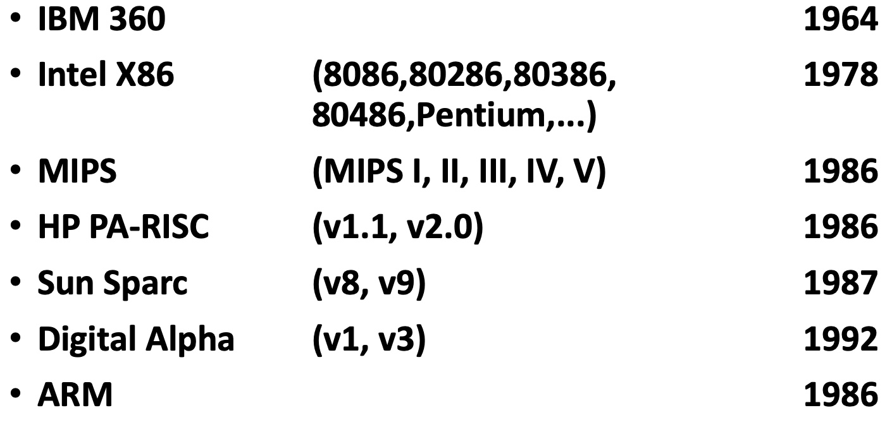

# Lesson1 Introduction to Computer Architecture

[TOC]

## Course outline

👧I move this part's content to README, including **Learning Object**, **Course Outline**, **Course Grading**, **Text Book and Course Coverage** and **What You Should Already Know**. Just add some comments here:

💡For **Learning Object**, architecture's function is to provide an **interface** between hardware design and software design. And I associate it with OS, which is also known as an **interface** between hardware and software. The difference is that operating system is a special software and we learn its design from the software view. While learning computer architecture is often from a hardware perspective.

❓Vector Computers: As the name implies, a computer that specially optimize the vector calculation.

❓some abbreviations
* FSM: Finite State Machine
* MUX: multiplexer
* ALU: arithmetic and logic unit


## What is Computer Architecture?

**Computer Architecture** = **Instruction Set Architecture** + **Machine Organization**

* Instruction Set Architecture (ISA): Instructions and their properties
* Machine Organization: Pipelining, Memory Hierarchy, Storage systems, etc.


## An early example of computer architecture

* IBM 360 (mainframe) 
* Intel X86 (Intel, AMD, Transmeta)
* ARM ISA (TI, Qualcomm, Samsung etc)

😯这里提到了atomic ISA？举了两个Integer相加例子，是否能由硬件一步到位，还是通过其它mechanism实现？【听得很模糊，口音较难理解，也许有偏差】

❓Mainframe computer: big computers used primarily by large organizations for critical applications (from wiki)

❓Transmeta: 全美达是一家设计超长指令字（VLIW）代码转译微处理器的美国有限公司，集中于开发减低电子设备功秏的运算技术，于1995年由Bob Cmelik、Dave Ditzel、Colin Hunter、Ed Kelly、Doug Laird、Malcolm Wing与Grzegorz Zynerlo创立，至今为止共出产了两款兼容x86架构的处理器：Crusoe与Efficeon， 该些处理器用于非常重视低功秏与散热能力的超便携式笔记本电脑、刀片服务器、平板电脑与安静型台式机上。(from wiki)

### IBM 360

check [IBM System/360 - Wikipedia](https://en.wikipedia.org/wiki/IBM_System/360)

💡Fred Brooks 的《人月神话》中很多开发经验来源于 IBM360

#### Background: Compatibility Problem at IBM

* By early 60s, IBM had 4 incompatible lines of computers: 701 650 702 1401
* Each system had its own
	* Instruction set
	* I/O system: magnetic tapes, drums and disks
	* Assemblers, compilers, libraries....
	* Market niche: business, scientific, real time, ...

=> IBM 360 by *Amdahl*, *Blaauw* and *Brooks*, 1964

* The design must lend itself to **successor machines**
* General (common) method for connecting to I/O devices

#### IBM 360: A General-Purpose Register Machine

check [IBM System/360 architecture - Wikipedia](https://en.wikipedia.org/wiki/IBM_System/360_architecture)

* Processor State
	* 16 General-Purpose 32-bit Registers
		* May also be used as **index** and **base register**
		* **Register 0** has some special properties
	* 4 Floating-Point 64-bit Registers
	* A Program Status Word (**PSW**) 64-bit Registers: PC, Condition codes, Control flags
* A 32-bit machine (data path) with **24-bit addresses**
	* But no instruction contains a 24-bit address
* Data Formats
	* 8-bit bytes, 16-bit half-words, 32-bit words, 64-bit double-words
	* **The IBM 360 is why bytes are 8-bit long today!**

❓"But no instruction contains a 24-bit address" means?

> System/360 uses **truncated addressing** similar to that of the UNIVAC III. That means that instructions do not contain complete addresses, but rather specify a base register and a positive offset from the addresses in the base registers. 
> In the case of System/360 the base address is contained in one of 15 general registers. In some instructions, for example shifts, the same computations are performed for 32-bit quantities that are not addresses. (from wiki)


💡check [IBM System/360 - Wikipedia](https://en.wikipedia.org/wiki/IBM_System/360) for more Influential features (industry standards for successors)

❓What is the difference between an assembler and a compiler?

🤔
```
+---------------------+                           +-------------------+
|                     |          Complier         |                   |
| High level language |    +----------------->    | Machine language  |
|                     |                           |                   |
+---------------------+                           +-------------------+

+---------------------+                           +-------------------+
|                     |         Assembler         |                   |
|  Assembly Language  |    +----------------->    | Machine language  |
|                     |                           |                   |
+---------------------+                           +-------------------+
```

❓What kinds of things may be written in assembly code?

👨‍🏫Device drivers. To make it as effcient as possible.

---

❓What is the difference between a base and an index register?

🤔check [Addressing Modes](http://www.cs.iit.edu/~cs561/cs350/addressing/addsclm.html)

👨‍🏫In the old days, base register is a register that points to the base of something, usually a data table in the memory. It should be large enough to hold any memory address of your software systems. Index register is like an index of the data table and we don't need so much bits to represent it, thus the size of it may smaller than base register.

👨‍🏫But time changes, since the memory is cheap, there is no much difference between these two registers at present. They are of the same size and we can mix and match registers much more freely.

---

❓Why do you think we switched from the 7-bit byte in the Univac(UNIVersal Automatic Computer) days to the modern 8 bit-byte? Hint: Think number system.

🤔8 is power of 2? Check [hardware - What is the history of why bytes are eight bits? - Software Engineering Stack Exchange](https://softwareengineering.stackexchange.com/questions/120126/what-is-the-history-of-why-bytes-are-eight-bits) for more discussions.

👨‍🏫There is no need to change since 7 bits is enough. But for base-2 computers, 8-bit byte is much easy to implement.

---

❓7 bits was sufficient to represent every printable character at that time. So why the extra bit?

🤔Maybe one bit for parity check?

👨‍🏫I'm right, it's for error checking.

---

❓What does "32-bit machine" mean?

👨‍🏫Refers to the data size that can be processed by CPU with any instruction been given by any of time. (around 20:00 some details don't hear clearly)

#### IBM 360: Initial Implementations

Model30 Model70 Model91 ... (see slide 12)

* IBM 360 instruction set architecture (ISA) completely hid the underlying technological differences between various models.
* **Milestone**: The first true ISA designed as portable hardware-software interface!
* **With minor modifications it still survives today!**

Just as the wiki said:

> The design made a clear distinction between architecture and implementation.


#### IBM 360 47 Years Later: zSeries z11

check slide 13 and [IBM Z - Wikipedia](https://en.wikipedia.org/wiki/IBM_Z) for more information.

Z13 release in 2016 
* 8 cores with SMT and
* Vector processing @ 5 GHz, 22n


❓Redundant datapaths: Every instruction performed in two parallel datapaths and results compared.

🤔for correctness and integrity?

## Computer Architecture Topics



## Example ISAs (Instruction Set Architectures)



❓Why is the IBM mainframe System Z being produced today?

🤔Since IBM seperates the architecture and implementation, and make it compatible to successors?

👨‍🏫Yes, bascially compatibility issues. Some programs written in old days can still execute successfully on IBM mainframe System Z produced nowadays. 

---

❓What are some examples of hazards?

🤦‍♀️no idea what this means...

---

❓Which ISA(s) in previous slide is (are) CISC?

🤔Intel X86, definitely. I am not sure about others.

👨‍🏫IBM 360 & Intel X86.

---

❓Explain the difference between CISC and RISC.

🤔CISC: Complex Instruction Set Computer; RISC: Reduced Instruction Set Computer. As their name implies, RISC is much easier to implement and efficient executed. A CISC instruction may conclude more than one low-level operations.

👨‍🏫
1. RISC is limited at accessing the memory, while CISC is open to it.
2. RISC uses the fixed-length encodings (4 bytes) of the instructions, while CISC adopts the variable-length encodings.
3. RISC provides fewer instructions than CISC.
4. RISC is easier to pipline compared with CISC.
5. Single clock	VS Multi-clock? 

---

❓I am quite confusing about the popularity of CISC and RISC in the market after listenning the tutorials?

🤔check [What's more popular today: RISC or CISC? - Quora](https://www.quora.com/Whats-more-popular-today-RISC-or-CISC) for more information. Interesting, “RISC inside CISC”.
