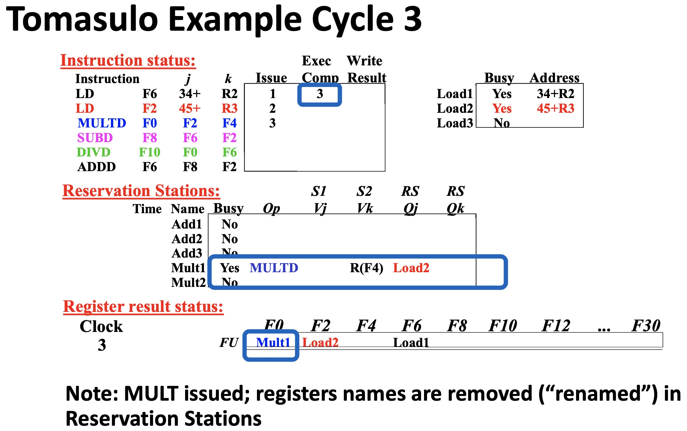

# Lesson 10 Dynamic Scheduling – Tomasulo’s Algorithm

[TOC]

## Objectives &  Prior Learning
* Analyze the use of dynamic scheduling
* Demonstrate understanding of Tomasulo’s Algorithm
* Analyze advantages and drawbacks related to Tomasulo’s Algorithm

Patterson, Chapter 3 and Appendix C 
* Advantages of dynamic scheduling
* Scoreboard example

## Dynamic Scheduling: Tomasulo’s Algorithm

### Background

* For IBM 360/91
* Goal: High Performance without special compilers
* Small number of floating point registers (4 in 360) prevented interesting compiler scheduling of operations
  * This led Tomasulo to try to figure out how to get more effective registers — **renaming in hardware!**

* Why Study 1966 Computer?
* The descendants of this have flourished! Alpha 21264, HP 8000, MIPS 10000, Pentium, PowerPC, ...

### Tomasulo Algorithm

* Control & buffers **distributed** with Functional Units (FU)
* FU buffers called “**reservation stations**”; have pending operands
* Registers in instructions replaced by values or pointers to reservation stations (RS);
  * Form of **register renaming**;
  * Avoids WAR, WAW hazards
  * More reservation stations than registers, so can do optimizations compilers can’t
* Results to FU from RS, **not through registers**, over **Common Data Bus** that broadcasts results to all FUs
* Load and Stores treated as FUs with RSs as well

---

* The main difference between Tomasulo’s algorithm and scoreboarding is that the control is distributed vs. the centralized scoreboard control.
* Each FU has its own buffers (for holding a queue of instructions waiting to be executed and their operands) called “reservation stations (RS),” and has its own local control so the overall control is distributed.
* The values of source operands for instructions are stored in the RS rather than kept in the RF and if operand is not yet available, a pointer to the RS that will produce it, is generated.
* A form of “register renaming” as RS buffers act as RF registers.

* It avoids WAW & WAR as they are due to reuse of registers.
* More RS than registers in the RF – can do optimizations that compilers can not as they can only access RF registers.
* Operands from one instruction to another not through RF registers but through a Common Data Bus (CDB).
* The result of an FU is broadcasted over the CDB and all RS monitor the CDB and grab the operand if they need it.
* CDB can be viewed as an extended version of forwarding: in forwarding the source and destination are known, CDB – bill board – destinations are not known to the sender.
* Load and Store behave similarly with load buffers and store buffers acting like RS.

### Tomasulo’s Organization

❓Does the CDB transmit only data?

a. Yes
b. No

🤔b. No. Some operation results in an address.

### Reservation Station Components

* Op: Operation to perform in the unit (e.g., ADD) 
* Vj, Vk: Value of Source operands
  * Store buffers has Vj field, result to be stored
* Qj, Qk: Reservation stations producing source registers (value to be written)
  * Note: Qj,Qk=0 => ready
* Busy: Indicates reservation station or FU is busy
* Register result status (Rg.Result) — Indicates which functional unit will write each register, if one exists. Blank when no pending instructions that will write that register.

❓What is the benefit of this?

🤔benefit of what?

### Three Phases of Tomasulo’s Algorithm

1. Issue — get instruction from FP Op Queue
   * If reservation station free (no structural hazard), control issues instruction & gets operands (renames registers)
2. Execute—operate on operands(EX)
   * When both operands ready then execute; if not ready, watch Common Data Bus for result
3. Write result—finish execution (WB)
   * Write on Common Data Bus to all awaiting units; mark reservation station available
   * Normal data bus: data + destination (“go to” bus)
   * Common data bus: data + source (“come from” bus)
     * 64 bits of data + 4 bits of Functional Unit (RS) source address
     * Does the broadcast
     * Other RS get data if “source” matches the ID of RS that is expected to produce the required operand
   * Example - speed of operations: 2 clocks for Fl.pt.ADD,SUB and LOAD; 10 for MULT; 40 clocks for DIV

### Tomasulo Example

* Same program that we used before
* Register Result Status – identical to scoreboard
* RS status – similar to FU status in scoreboard but main difference Vj and Vk each have 64 bits
* Instruction status table is not implemented in HW and appears here only for purpose of us understanding what is happening in each cycle.
* Approximate number of bits in an RS: 1+3+64+64+4+4 = 140 bits!
* Assuming here 3 RS in front of FP adder, 2 in front of FP multiplier and 3 load
buffers (no Store instructions in our program)

❓Issue ADDD here despite name dependency on F6?

🤔I think it's feasible since the register content has already been fetched. 

### Drawbacks

* High Complexity (large circuit, high power consumption)
* Many stores (CDB) at high speed resulting limit on performance by Common Data Bus
  * Each CDB must go to multiple functional units =》 high wiring density, high capacitance
  * Number of functional units that can complete per cycle limited to one!
    * Multiple CDBs =》 more FU logic for parallel stores
    * CDB is the only centralized resource – may become a bottleneck;
    * CDB must be connected to all FUs – large number of wires with high capacitance – slowing down the operation
* Non-precise interrupts!
  * We will address this later

❓Explain the fundamentals of Tomasulo’s Algorithm, including: 
* Purpose and goal of dynamic scheduling
* Benefits
* Drawbacks
* Difference between Tomasulo’s Algorithm and scoreboarding
* Relationship to registers (effects, etc.)
* Phases

---

PS: I don't follow well in this lecture, too much words in PPT and strong accent...