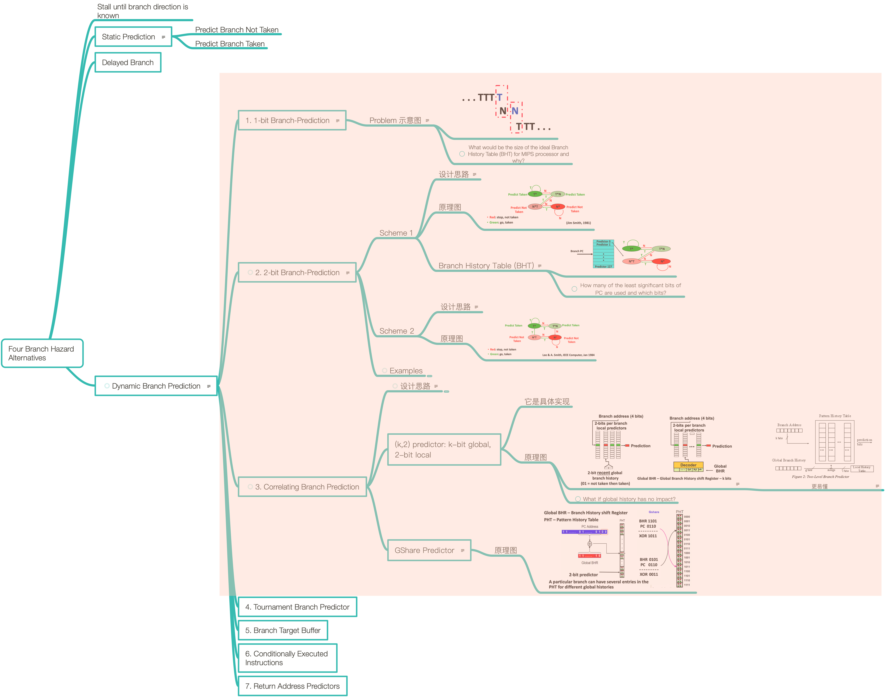

# Lesson 13 Dynamic Branch Prediction

[TOC]

## Objectives &  Prior Learning
* Analyze characteristics of static branch prediction
* xplore seven branch prediction schemes
* Evaluate accuracy of various schemes

Patterson, Chapters 1 and 3, and Appendix C
* Overlapping execution of loops
* Saw how several loop iterations can execute concurrently because of register renaming where the output of one operation is sent directly to the input of the next bypassing the register
* Saw how the functional unit’s reservation stations holds the input data for its operation
* Saw how this technique is able to avoid WAW, and WAR hazards

## Contents

I will no longer take notes of previous format since I found what I learned focuses more on understanding rather than memorizing. In this case, I use mindnode to take notes to ensure I have a systematic understanding of what I have learned.

