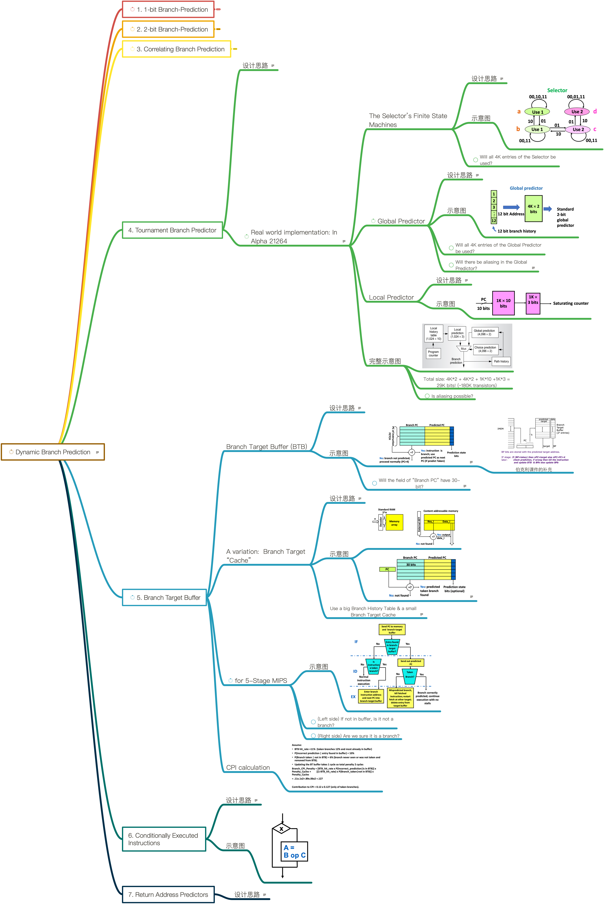

# Lesson 14 Tournament Predictors and Branch Target Buffer

[TOC]

## Objectives &  Prior Learning
* Analyze characteristics of tournament predictors
* Evaluate accuracy of branch prediction
* Explore branch target cache and buffer
* Explore predicated execution
* Analyze pitfalls of branch prediction

Patterson, Chapters 1 and 3, and Appendix C
* Static predictions
* Dynamic prediction (local and global)
* 1 & 2-bit dynamic branch prediction schemes 
* Correlating branch prediction
* Branch history table

## Contents

