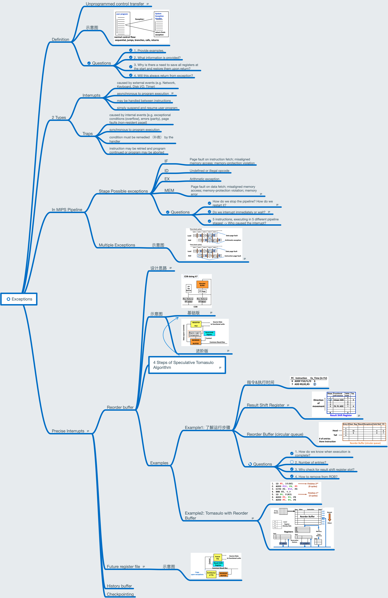

# Lesson 15 Exceptions and Tomasulo with ROB

[TOC]

## Objectives &  Prior Learning

* Explore the basics of exceptions
* Analyze exceptions related to various computer architecture topics

Patterson, Chapter 3 and Appendix C
* Tournament predictor in Alpha 21264
* The selector for either global or local predictor
* Global predictor
* Local predictor
* Branch target cache

## Contents

