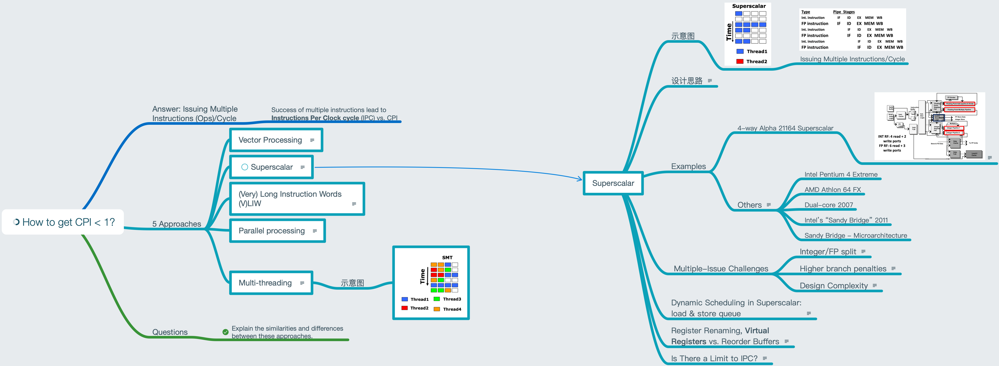

# Lesson 16 Superscalars

[TOC]

## Objectives &  Prior Learning

* Analyze conditions for issuing multiple instructions per cycle
* Identify challenges related to issuing multiple instructions
* Explore dynamic scheduling in superscalar
* Analyze ILP

Patterson, Chapter 3 and Appendix C
* Precise interrupts/exceptions
* Hardware support for precise interrupts
* Reorder buffer
* Right shift register
* Tomasulo’s algorithm with reorder buffer example

## Contents

