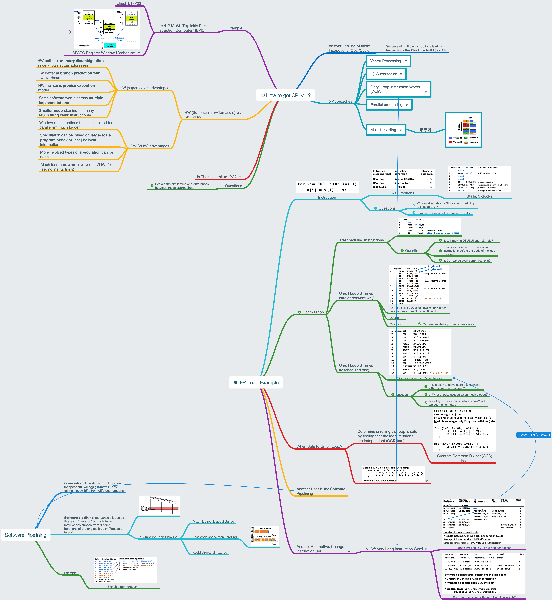

# Lesson 17 Compiler Techniques and VLIW

[TOC]

## Objectives &  Prior Learning

* Analyze examples of and hazards related to FP loops
* Analyze unrolled loops
* Analyzed complier perspectives on code movement
* Explore software pipelining
* Explore characteristics and drawbacks of VLIW
* Compare advantages of HW and SW
* Explore explicitly parallel instruction computer (EPIC)

Patterson, Chapter 3 and Appendix C
* Conditions for issuing multiple instructions per cycle
* Challenges related to issuing multiple instructions
* Dynamic scheduling in superscalar
* ILP

## Contents

