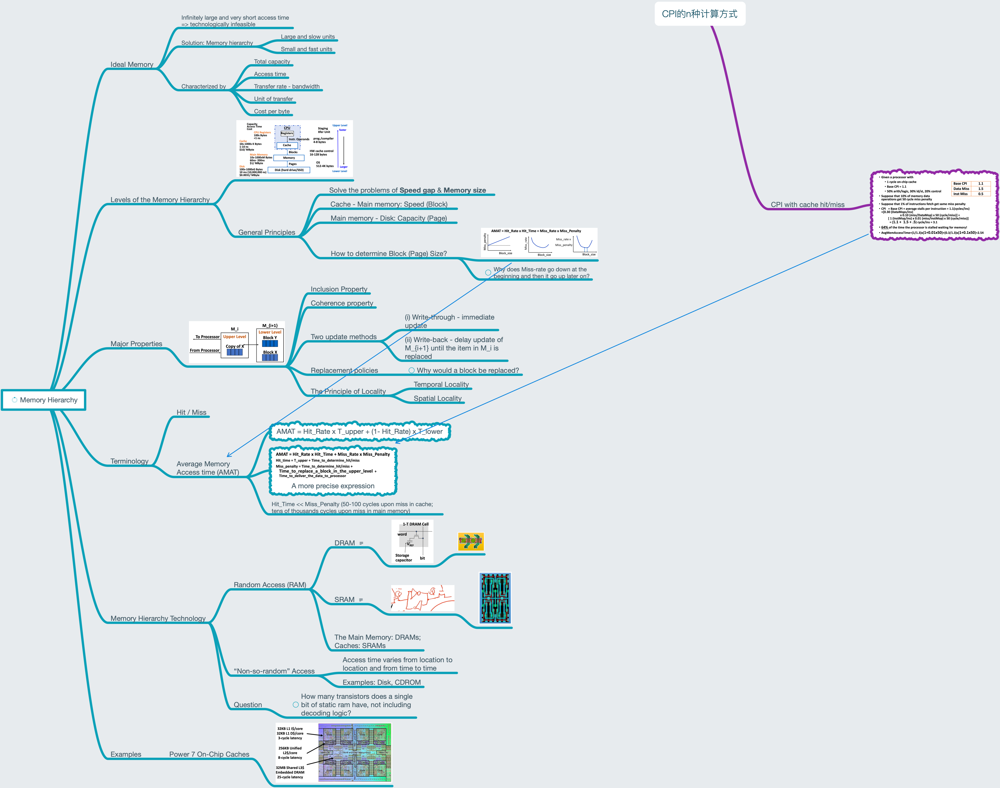

# Lesson 18 Memory Hierarchy: Principles

[TOC]

## Objectives &  Prior Learning

* Analyze the purpose of cache
* Compare types of cache
* Explore disadvantages of various types of cache
* Explore levels of hierarchy related to cache
* Explore (overlapped) translation look-aside buffers

Patterson, Chapter 2 and Appendix B
* Examples of and hazards related to FP loops
* Unrolled loops
* Complier perspectives on code movement
* Software pipelining
* Characteristics and drawbacks of VLIW
* Advantages of HW and SW
* Explicitly parallel instruction computer (EPIC)

## Contents

