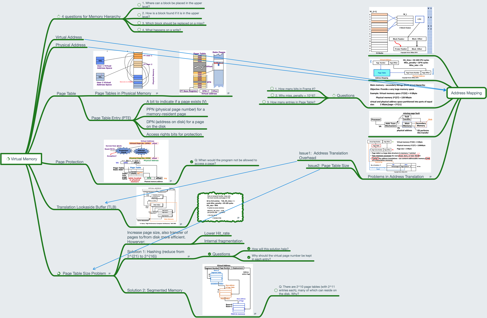

# Lesson 19 Virtual Memory

[TOC]

## Objectives &  Prior Learning

* Explore virtual memory and segmented memory
* Analyze address mapping and translation overhead
* Analyze paging organization
* Examine page tables

Patterson, Chapter 2 and Appendix B
* Hierarchical memory systems
* Types of memory and their access times
* Memory paging, hits and misses

## Contents

