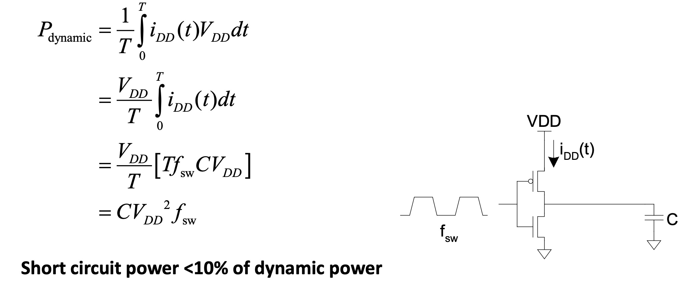

# Lesson2 Performance Metrics and Benchmarks

[TOC]

## Objectives & Prior Learning

* Identify issues related to compatibility
* Examine components of IBM machines
* Analyze performance measures and benchmarks

👧简单的说，比一比哪个计算机好。

Textbook: Chapter 1 and Appendix C:
* Define Computer Architecture
* Explain machine code compatibility with future versions of the machine
* Understand characteristics of computer architecture
* Define Instruction Set Architecture (ISA) and hardware (HW) organization to provide interface between hardware and software

Compared to the CISC architecture:

❓Why in the RISC architecture there are LD and ST instructions only?

🤔RISC don't need much interaction with memory and calculations are based on registers. Thus register need to use either LD or ST to contact with data in the memory.

---

❓Why in the RISC architecture are all the instructions the same length?

🤔I think it's just a design to make it easy. Same length is better for pipline.

---

❓Why is the RISC architecture considered to provide higher processor performance?

🤔It's easy and efficient to execute. Each instruction takes one cycle. The same length property is also good for pipline. These things make it have higher processor performance.

---

❓Why the RISC architecture that has fewer instructions, runs faster?

🤔I think the reasons are similar to the previous question.

## How to Measure Performance

* Time to run the task
	* Execution time, response time, latency
* Performance may be defined as the inverse of execution time
	* Tasks per day, hour, minute, ...
	* Throughput, bandwidth
* Individual application vs. System management

## Examples of some metrics

### Speedup

performance = 1 / Execution Time


"Y is N times faster than X" means:

N = speedup = Execution_time(old brand x) / Execution_time(new brand y) = 1 + w/100


Speedup must be greater than 1; speedup of w%

Ex. Tx/Ty =3/2=1.5 but not Ty/Tx = 2/3 = 0.67


### MIPS and MFLOPS

* MIPS (Million Instructions Per Second)
	* Can we compare two different CPUs using MIPS?

* MFLOPS (Million Floating-point operations Per Second)
	* Application dependent (e.g., compiler)

* How do we compare two computer systems?

* Use benchmarks
	* Standard representative programs

## Examples of benchmarks

* Benchmarks: e.g., SPEC CPU2000: 26 applications (with inputs)
	* SPECint: Twelve integer, e.g., gcc, gzip, perl
	* SPECfp: Fourteen floating-point intensive, e.g., equake

❓Can we compare two different CPUs using MIPS?

🤔Only when comparing performance between processors made with similar architecture.

ℹ️SPEC CPU Benchmark: check slide 9 and [SPEC - Standard Performance Evaluation Corporation](https://www.spec.org/).

ℹ️Other Benchmarks: check slide 10

L. John, "Performance Evaluation: Techniques, Tools and Benchmarks," The Computer Engineering Handbook, CRC Press, 2001.

ℹ️Synthetic Benchmarks: check slide 11

> Synthetic benchmarks are artificial programs that are constructed to try to match the characteristics of a large set of programs. The goal is to create a single benchmark program where the execution frequency of statements in the benchmark matches the statement frequency in a large set of benchmarks. refer this [link](https://course.ccs.neu.edu/cs3650/ssl/TEXT-CD/Content/COD3e/InMoreDepth/IMD4-Synthetic-Benchmarks.pdf) for more information.

💡Alleviate the previous benchmarks' problem: time consuming

The most popular synthetic benchmarks: 
* Whetstone Benchmark
* Dhrystone Benchmark


## Goals of new computer designs 目标

* Higher performance
* More functionality (e.g., MMX,SSE,AVX)
* Other design objectives? (examples)

❓MMX: [MMX - 维基百科，自由的百科全书](https://zh.wikipedia.org/wiki/MMX)

❓SSE: [SSE - 维基百科，自由的百科全书](https://zh.wikipedia.org/wiki/SSE)

❓AVX: [AVX指令集 - 维基百科，自由的百科全书](https://zh.wikipedia.org/wiki/AVX%E6%8C%87%E4%BB%A4%E9%9B%86)


❓Other design objectives? (examples)

👨‍🏫low power / reduce the chip area / reduce the heat / add the security support

## How Do We Design Faster CPUs? 方法

* Higher frequency — used to be the main approach
	* (a) Power density — too high — hard to dissipate the heat
	* (b) Reliability & yield — getting low

* Larger dies (SOC - System On a Chip)
	* Less wires between ICs but - low yield (next slide)

* Parallel processing - use n independent processors
	* Limited success for large n when executing a single application

* n-issue superscaler microprocessor (currently n=4)
	* Can we expect a Speedup =n ?

* Pipelining

* Simultaneous multi-threading


❓Why is SOC a solution?

🤔The communication latency may be reduced?

👨‍🏫Yes, but we should notice that it may lead to low die yield. Hopefully, as the manufacturing becomes much more mature, then die yield problem may be relieved. From this view, SOC is acceptable.

---

❓Why are there empty slots in the previous slide diagram?

🤔~~Maybe current CPU time is given to this thread but it needs to waiting for I/O, locks and so on?~~

👨‍🏫There are some dependencies between different instructions. You do have the resources but the instructions can't use it. 

---

❓What needs to be replicated for SMT?

🤔pre thread state, stacks, registers...


## Energy and Power

```
Total Power consumption = Dynamic Power + Static Power

Energy = Power * T
```

### Dynamic Power

* Due to signals switching.
* Required to charge and discharge load capacitances when transistors switch.
* One cycle involves a rising and falling output.
  * On rising output, charge Q = CV_{DD}, is required.
  * On falling output, charge is dumped to GND.
* Current Components:
  * Charge/discharge current
  * Short-circuit current





### Static Power

* Due to leakage currents in Transistors
  * Junction leakage
  * Gate oxide leakage
  * Subthreshold leakage



### Conclusion

❓Why low clock frequency growth in the past 17 years? (slide 19)

🤔The higher of the clock frequency, the more powerful of the CPU.

**Techniques for reducing power**(slide 20): 
  * Do nothing well
  * Dynamic Voltage-Frequency Scaling
  * Low power state for DRAM, disks
  * Overclocking, turning off cores


## Integrated Circuits Yield

Die Yield = Wafer yield * (1 + Defect Density * Die area / alpha)^(-alpha)


❓Wafer yield: wafers that are not scrapped.

❓Die Yield: the number of good dice that pass wafer probe testing from wafers that reach that part of the process.

❓alpha: a measure of manufacturing difficulty


💡Some of ideas are really difficult for beginners, so I found some articles to understand them:

- [CPU制造的那些事之一：i7和i5其实是孪生兄弟！？ - 知乎](https://zhuanlan.zhihu.com/p/29743431)
- [CPU制造的那些事之二：Die的大小和良品率 - 知乎](https://zhuanlan.zhihu.com/p/29767262)
- [Yield - WikiChip](https://en.wikichip.org/wiki/yield)


> 大圆就是晶圆，小方格就是CPU的Die。我们可以看到其中的缺陷就像撒芝麻粒，斑斑点点，而且越靠近边角越可能出现，很多小格都有（量产后不会有这么多）。良品率高，品质控制的好，芝麻粒就少。

**Defects**


## Integrated Circuits Costs

check textbook p31(63 for my PDF viewer)

IC cost = (Die cost + Testing cost + Packaging cost) / Final test yield

Die cost = Wafer cost / (Dies per Wafer x Die Yield)

Dies per wafer = pi * (Wafer_diam/2)^2 / Die_Area - pi * Wafer diam / √ (2 * Die Area) - Test_Die

📗The first term is the ratio of wafer area to die area. The second compensates for the “square peg in a round hole” problem—rectangular dies near the periphery of round wafers. Dividing the circumference by the diagonal of a square die is approximately the number of dies along the edge.

**Die Cost goes up roughly with (Die_Area)^3**

❓why 3 times? I think just 3/2 times???

## Intel’s Clovertrail — Smartphone SOC (2013)


 


