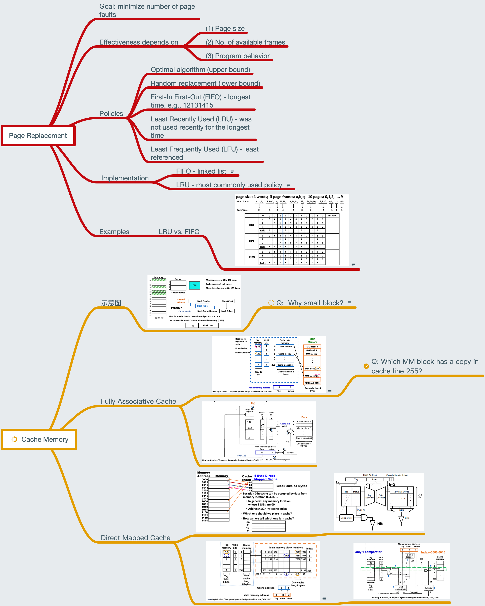

# Lesson 20 Page Replacements and Cache Basics

[TOC]

## Objectives &  Prior Learning

* Explore page/block replacement policies
* Describe two cache organizations

Patterson, Chapter 2 and Appendix B
* Virtual and segmented memory
* Page tables
* Address mapping and its overhead

## Contents

