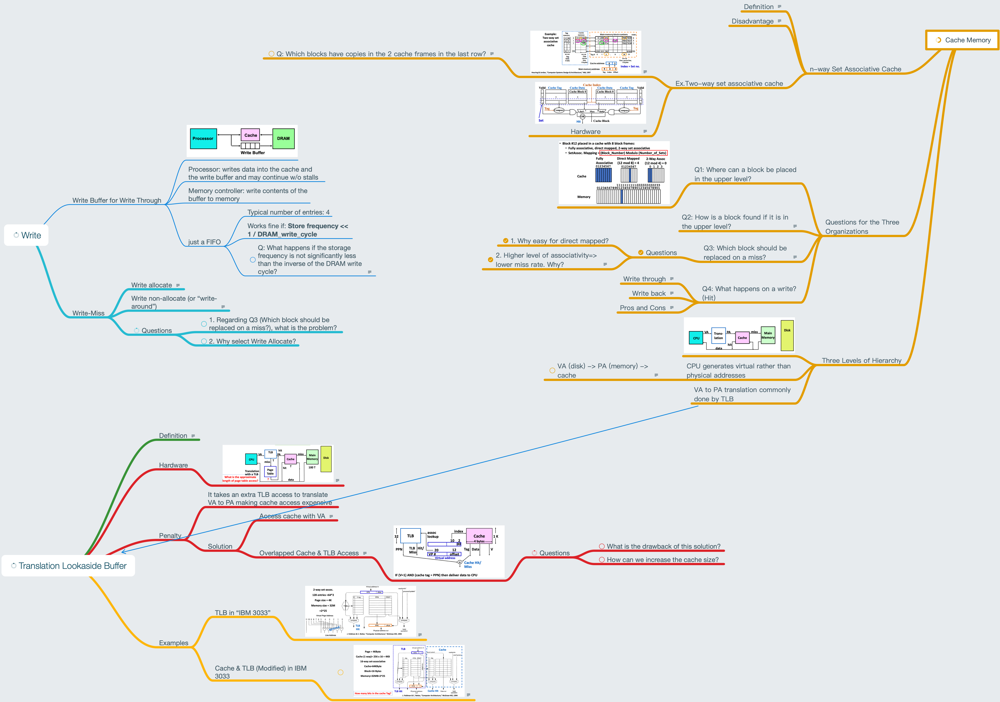

# Lesson 21 Set Associative Cache and TLB Design

[TOC]

## Objectives &  Prior Learning

* Compare n-way set associative cache and two-way set associative cache 
* Explore write buffer for write through
* Analyze three levels of hierarchy
* Explore translation look-aside buffers (TLB)
* Explore virtual address and a cache

Patterson, Chapter 2 and Appendix B
* Page replacement policies
* Least recently used (LRU) versus first in first out (FIFO) 
* Basic cache

## Contents

