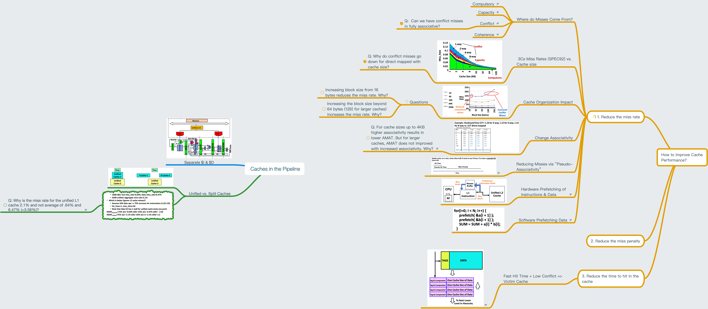

# Lesson 22 Reducing Cache Miss Rate

[TOC]

## Objectives &  Prior Learning

* Explore cache measures and performance 
* Evaluate types of caches
* Analyze misses
* Explore hardware prefetching
* Demonstrate mastery of course concepts

Patterson, Chapter 2 and Appendix B
* 2-way set associative cache
* N-way set associative cache
* Write buffer write through
* Virtual address and cache
* Overlapped cache and TLB access

## Contents 

I only include part of my notes since they are sperated.

