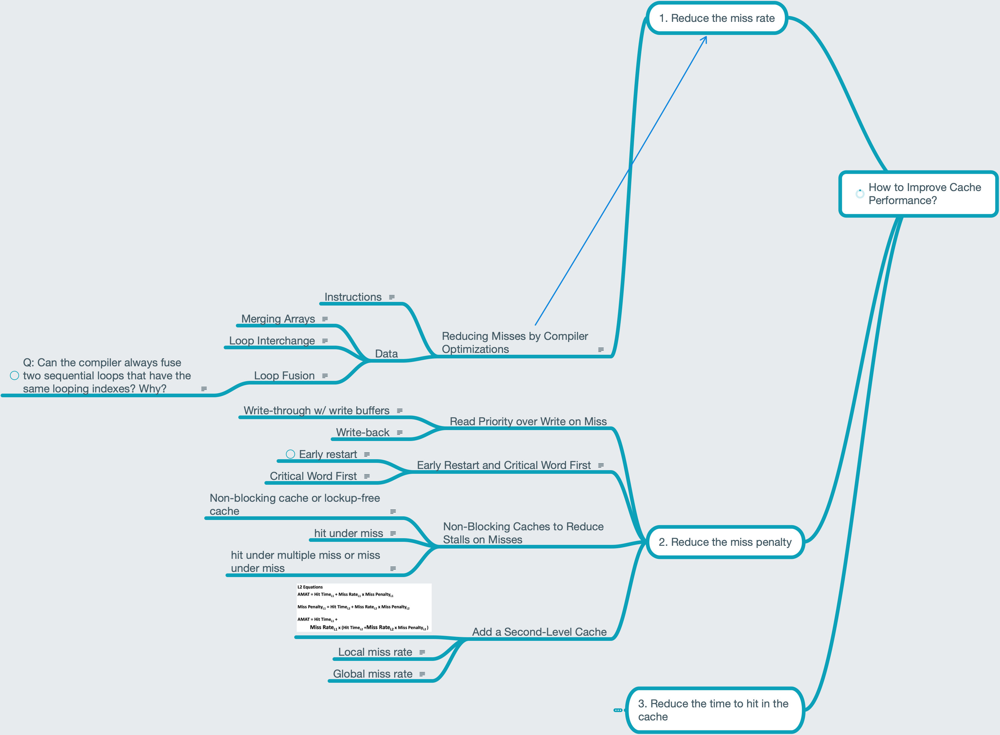

# Lesson 23 Reducing Cache Penalty

[TOC]

## Objectives &  Prior Learning

* Analyze merging arrays
* Analyze loop interchange
* Analyze loop fusion
* Analyze compiler optimizations
* Explore methods for reducing miss penalty

Patterson, Appendix D
* Cache measures
* Cache performance on CPU
* Reducing misses by “pseudo-associativity”
* Reducing misses by hardware prefetching
* Reducing misses by software prefetching

## Contents 

