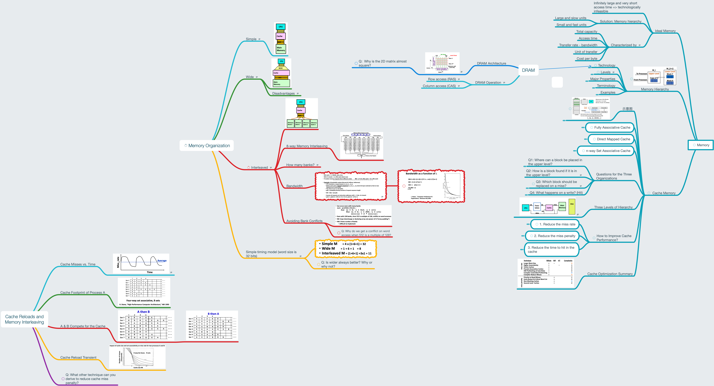

# Lesson 24 Cache Reloads and Memory Interleaving

[TOC]

## Objectives &  Prior Learning

* Analyze the cache optimization summary
* Analyze cache footprints
* Analyze cache reload transient
* Explore main memory background and DRAM architecture / operation
* Compare wide memory and interleaving
* Explore bandwidth

Patterson, Appendix D
* Compiler optimization for reducing cache misses 
* Read priority over write
* Early restart
* Non-blocking cache
* Add second level cache

## Contents 

So many concepts! And they are distributed. I still don't understand the Bandwidth calculation.

