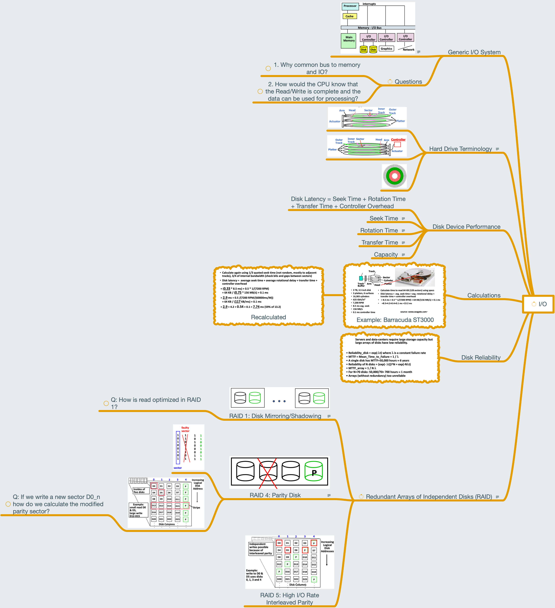

# Lesson 25 Input / Output Overview and Hard Drives

[TOC]

## Objectives &  Prior Learning

* Analyze rationale for using input/output
* Explore input/output systems
* Identify parts of a disk
* Demonstrate understanding of disk device performance
* Analyze the concept of and techniques related to RAID
* Compare solid state drives and hard disk drives

Patterson, Appendix D
* Relation of cache misses to time
* Main memory background
* DRAM back ground
* Memory/cache organization 
* Wide memory versus interleaving
* 8-way interleaving

## Contents 

