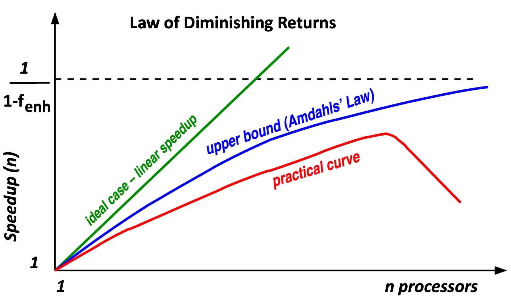
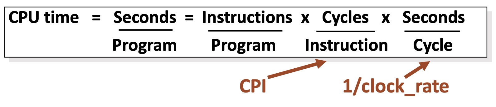
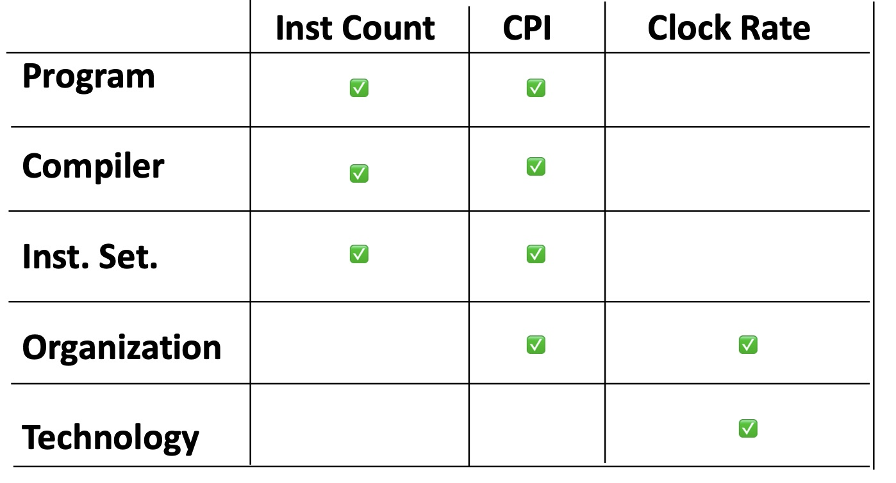
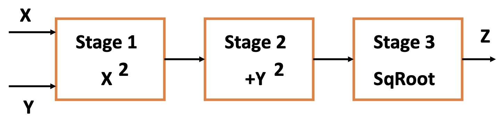
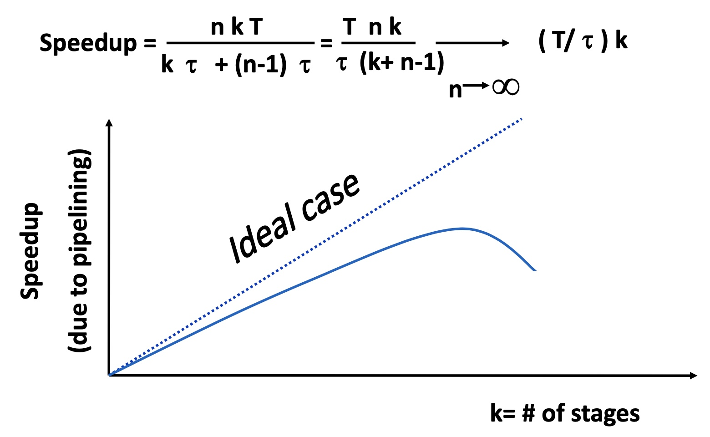
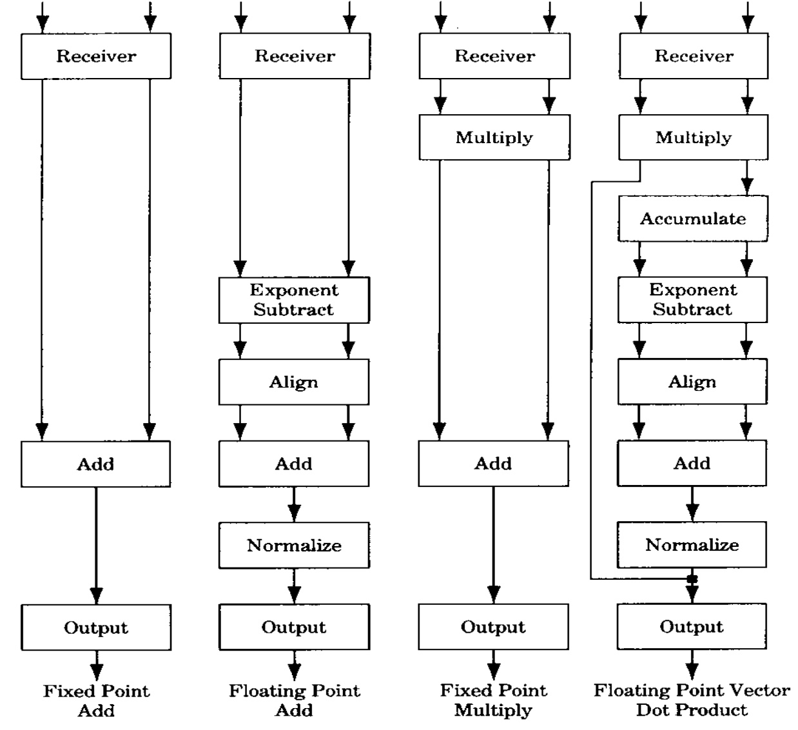
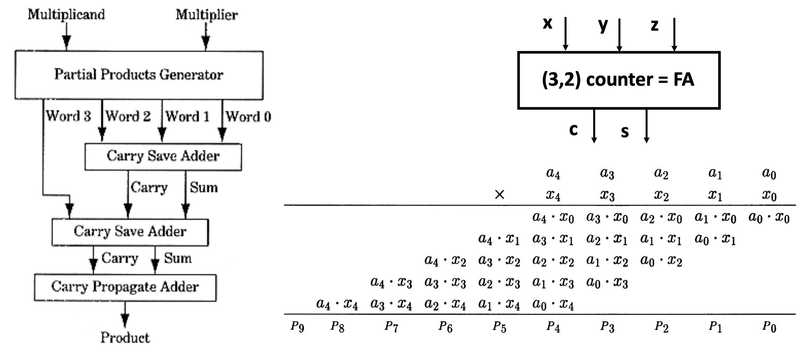
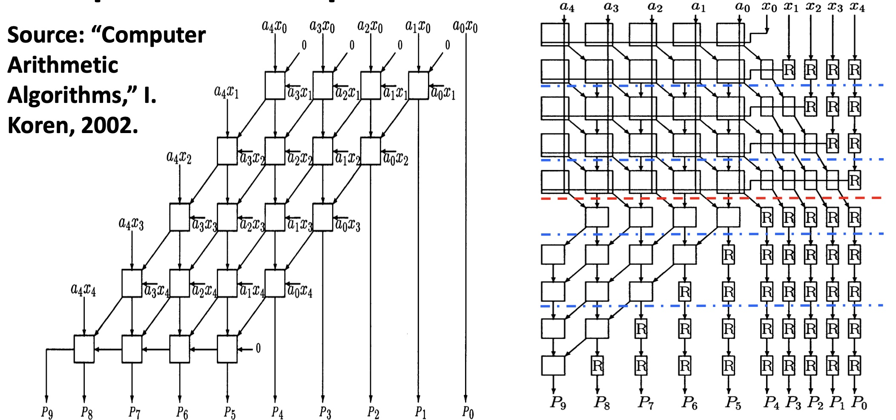

❓Besides higher frequency, larger dies, more parallel processing, superscalar,
pipelines, and simultaneous multithreading, what other ways can you think of
that can be used to increase processor speeds?

🤔Increase the voltage. Re-design the adder, multiplier, divider... Any component that needed in the ALU implementation. Caches maybe, since if the memory access is slow, it will become the bottleneck and limit the processing speed.


# Amdahl’s Law

Assume we are xecuting a program on N independent processors:

```latex
Fraction_{enhanced} = parallelizable part of program 

Speedup_{enhanced} = n

ExTime_{new} = ExTime_{old} * (1 - Fraction_{enhanced}) + ExTime_{old} * Fraction_{enhanced} / n

Speedup_{overall} = ExTime_{old} / ExTime_{new} = 1 / [(1 - Fraction_{enhanced}) + Fraction_{enhanced} / Speedup_{enhanced}]

lim(n->$\infty$) speedup_{Overall} = 1 / (1 - Fraction_{enhanced})
```

👧We notice that there is an upper bound of the overall speedup, that is `1 / (1 - Fraction_{enhanced})`. Slide 8 gives an example.

---

❓For the upper bound of 1.66 how much time does Mpy take?

🤔Infinite close to zero?

---



❓Why does the practical curve go down?

🤔As the number of processors becomes larger, the running program should be cut into more divisible parts. That's hard when the tasks are really small enought that can't be divided any longer. In that case, some processors are redundant and they can't be taken good advantage.

# CPI

Average CPU time per program:




ℹ️End to End Argument: what RISC was ultimately about - it is the performance of the complete system that matters, not individual components!

check the [original paper](https://web.mit.edu/Saltzer/www/publications/endtoend/endtoend.pdf) and [zhihu explanization](https://zhuanlan.zhihu.com/p/55311553).

### Aspects of CPU Performance



### Cycles Per Instruction

**Average Cycles per Instruction:**

CPI = Total_No_of_Cycles / Instruction Count

**CPI of Individual Instructions:**

CPl_j - CPI for instruction type j (j=1,...,n)

I_j - # of times instruction j is executed

CPU time = Cycle Time x sum(CPI_j * I_j)

**Instruction Frequency:**

CPI = sum(CPI_j * F_j) where F_j = I_j / Instruction Count

Check slide 12 for a calculation example.


❓Why is ALU only one cycle?

🤔Compared with load, store, ALU don't need to be interacted with memory, which takes a long time to execute; compared with branch, ALU is determinstic and sequential.

# Arithmetic Pipelines

### Ideal vs non-ideal pipelines



* latency
* throughput
* Speedup
* Non-Ideal -> latches


**k-stage Pipeline - Speedup:**



### Arithmetic Pipelines

TI 家的 Advanced Scientific Computer (check [wiki](https://en.wikipedia.org/wiki/TI_Advanced_Scientific_Computer) for more info):



❓What can be done to remove the bottleneck?

🤔Confused about the question.

---

Multiplier ->  Pipelined Multiplier



