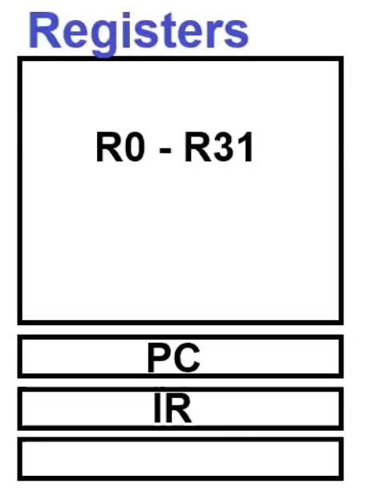
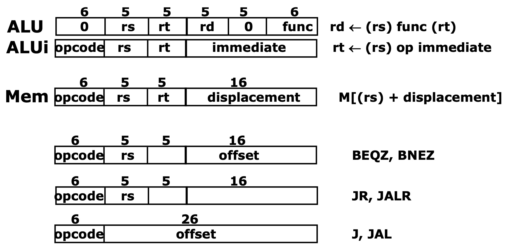
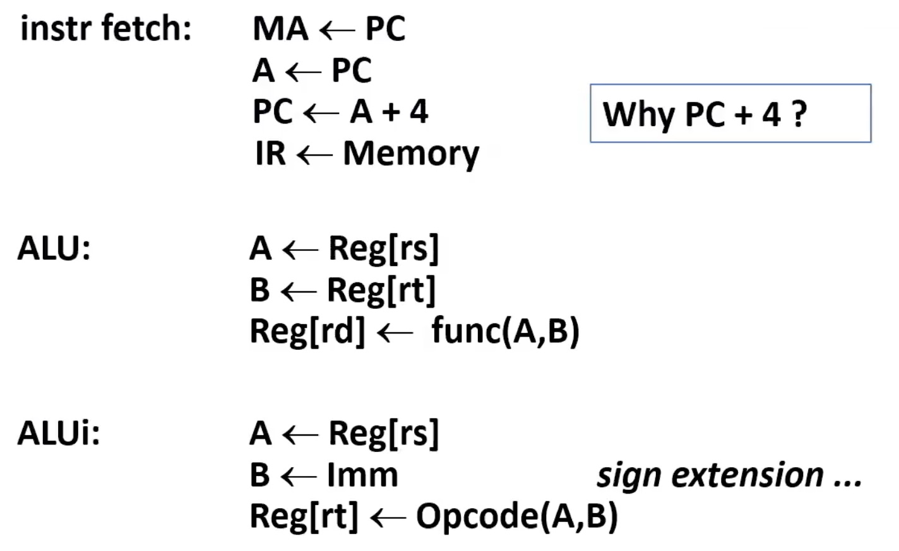
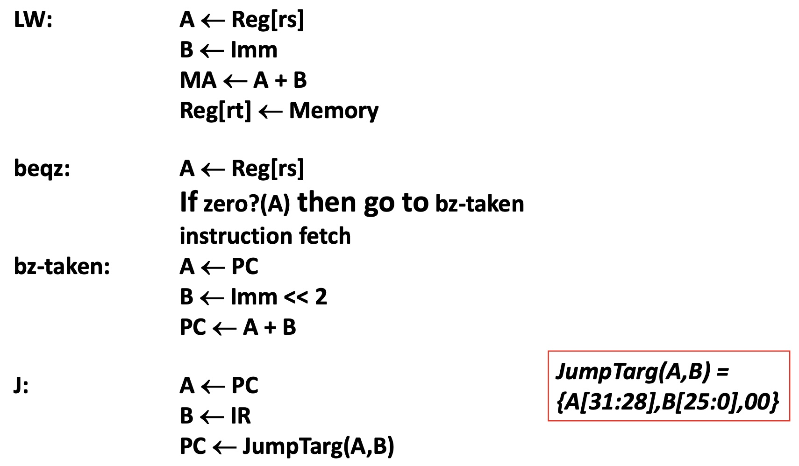
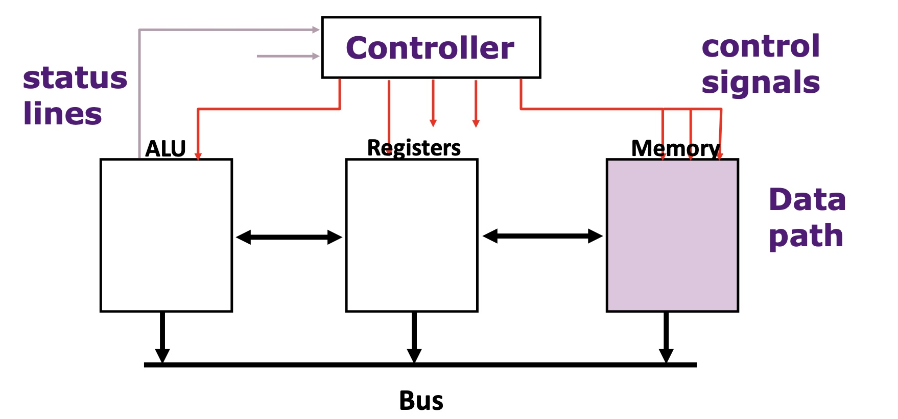
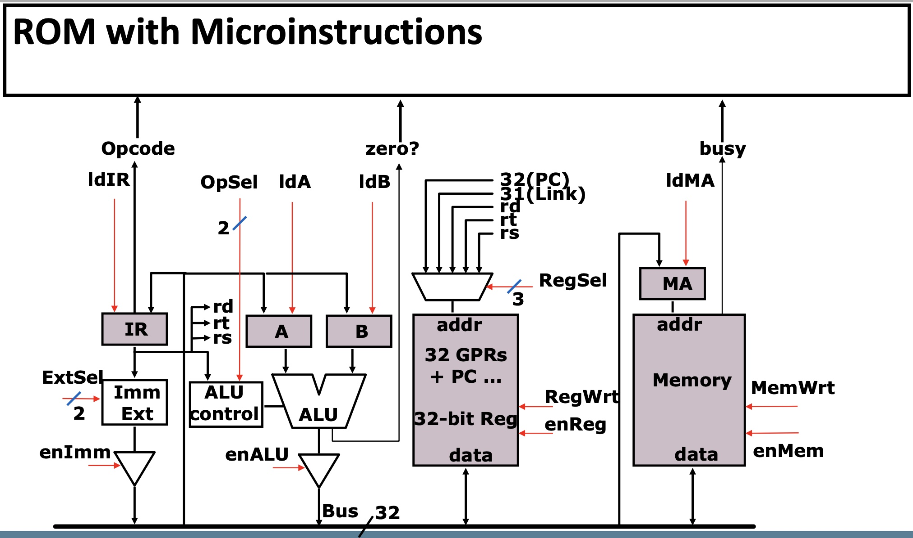
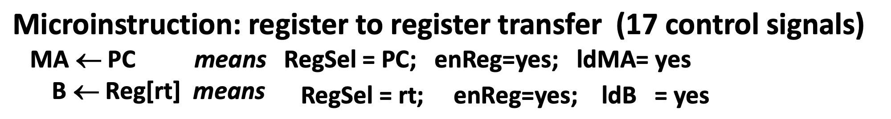

# Lesson4 MIPS Micro-Architecture

[TOC]

## Objectives &  Prior Learning

* Analyze characteristics of pipelines
* Explore a typical RISC / MIPS
* Explore data formats and memory addresses
* Demonstrate understanding of control signals
* Analyze steps of MIPS datapaths


Patterson, Chapter 3 and Appendix C
* Amdahl’s Law
* Cycles per instruction
* Pipelining basics

---

❓In reference to the problem of solving four operations of the equation below:

```
Z=F(x,y)=sqrt(x^2+y^2)
```

What possible problems, related to the input variables, may be caused in the parallel processing implementation? Will the same problems also show up in a non-pipelined implementation? What are the differences?

🤔Both variable x and y need to be squared, so if there is only one hardware for square, then one variable will wait for the other one to complete the square operation. But for non-pipelined implementation, these problems won't happen, since the operations are executed one by one, sequentially.

---

❓What are the differences between relative and direct/absolute addressing modes and which one is preferred in processors and why?

🤔Relative one means the address should be calculated based on a baseline and we will add some offsets to it. Direct or absolute addressing means the actuall address has already been given so we don't need to calculate it anymore. I think the latter one is preferred in processors since they don't need a *adder* hardware for address calculation.


## Instruction pipelines


* Execute billions of instructions, so **throughput** is what matters
* What is desirable in instruction sets for pipelining?
  * Variable length instructions vs. all instructions same length?
  * Memory operands part of any operation vs. memory operands only in loads or stores?
  * Register operand in various places in instruction format vs. registers located in same place?
* Conclusion: **RISC** is easier to pipeline.


## MIPS 

### A "Typical" RISC

* 32-bit fixed length instruction (3 formats)
* Memory access only via load/store instructions
* 32 32-bit GPR (RO contains zero)
* 32 32-bit FPR — 16 64-bit double-precision
  * DP uses a pair 
* 3-address, reg-reg arithmetic instruction; registers in same place in instruction format
* Single address mode for load/store: base + displacement
* Simple branch conditions; addressing modes: PC relative and register indirect
* Delayed branch
* Some versions of SPARC, MIPS, HP PA-Risc, DEC Alpha, IBM PowerPC, DSP processors

### Data Formats and Memory Addresses

* Data formats
  * Bytes, half words, words and double words
* Byte addressing
  * Most significant Byte VS Least significant Byte
  * Big Endian VS Little Endian
* Word alignment
  * Byte addressable memory
  * A word address can begin only att 0,4,8...


❓MIPS 的 Endian type？

🤔盲猜一个Big Endian，因为感觉用Little Endian的比较少。

### instruction set architecture

Instruction Categories
* Load/Store
* Computational (Fixed-point etc)
* Floating-Point
* Jump and Branch
* Special








### Instruction Execution

1. instruction fetch

2. decode and register fetch

3. ALU operation

4. memory operation (optional)

5. write back to register file (optional)

### Control Signals



❓Why PC + 4?

🤔A instruction is of 32 bits. 32 bits is equal to 4 bytes. Since the memory is byte addressable, so we use PC + 4 to access the next instruction.



Alternative: Microinstructions

## Micro-architecture

###  Microarchitecture: Bus based Data Path (Implementation of an ISA)





Accroding to the previous image, we can know that:



---

❓Can a Jump (JP) instruction in a MIPS processor-based computer transfer the control to any instruction in the system memory space or not and why?

🤔I think no. JP instruction only can jump to the user's codes.

---

❓What about a Branch (BR...) instruction?

🤔My answer is the same.

---

❓Can the design on page 15 be pipelined? Why or why not?

🤔Yes. Just divide it into several stages and make sure each stage doesn't have hardware conflict.