# Lesson5 MIPS Instruction Pipeline

[TOC]

## Objectives &  Prior Learning

* Explore the stages of pipelining
* Analyze the steps of MIPS datapath
* Explore methods for visualizing pipelining
* Explore methods for calculating CPI
* Analyze structural hazards


Patterson, Chapter 3 and Appendix C 
* Typical RISC architecture
* RISC data formats and memory addresses 
* MIPS Instruction set architecture
* MIPS control signals and data paths

# Pipeline Stages

2 stages or 5 stages:

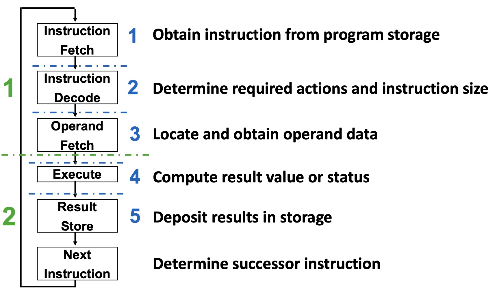

# Pipeline Datapath

## datapath w/o pipeline registers

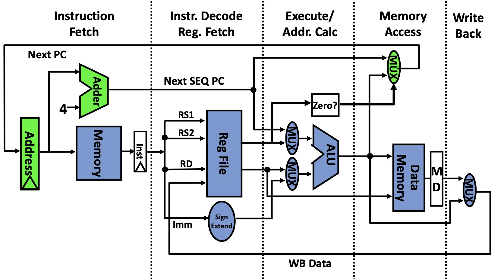

❓What is the Address register?

🤔To store the instruction address.

---

❓Why +4?

🤔To fetch the next instruction. The instruction is 32-bit and is accessed by byte-addressing mode.

---

❓What are the 2 inputs to DataMem?

🤔The data's address that will be overwritten and the updated value.

---

❓What instruction uses MD?

🤔I don't know what MD short for...

---

❓What is the purpose of Mux?

🤔Combined with some control signals to select a correct way, that means doing sth or not.

---

❓Can this implementation (without the common bus) be pipelined?

🤔Yes.

## datapath with pipeline registers

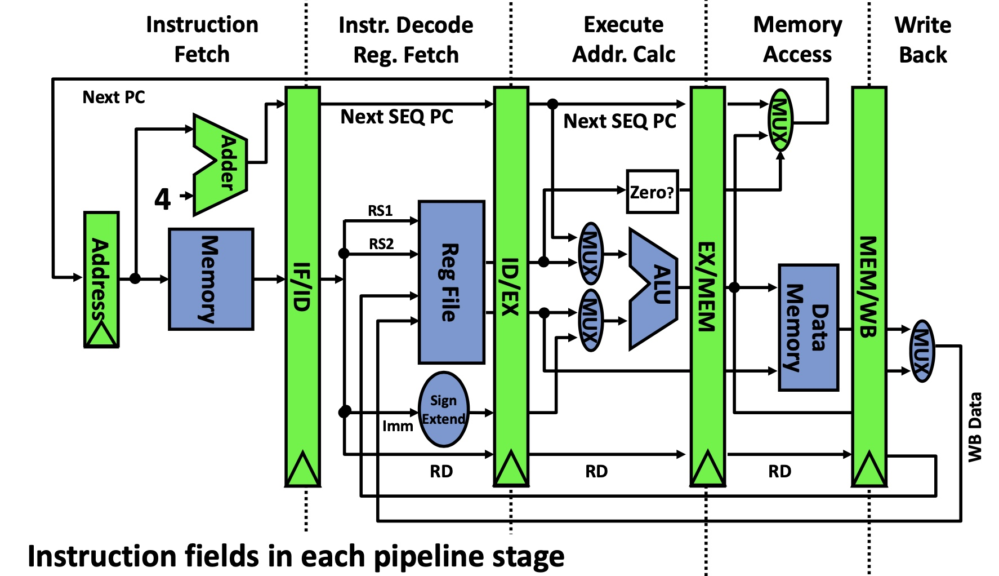

## pipelined datapath 

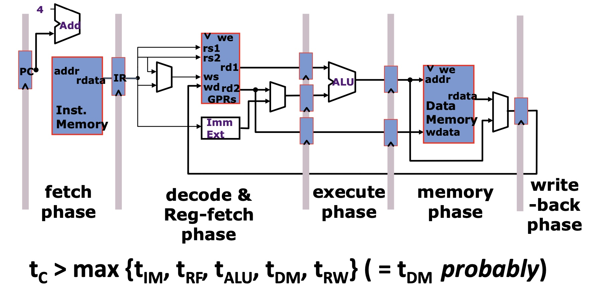

And there are some technology assumptions to ensure:

* A small amount of very fast memory (caches) backed up by a large, slower memory
* Fast ALU (at least for integers)
* Multiported Register files (slower!)

Thus, the following timing assumption is made:

t_{IM} ≈ t_{RF} ≈ t_{ALU} ≈ t_{DM} ≈ t_{RW}

# 2 ways to visualize the pipeline

Visualizing Pipelining - 1st way:

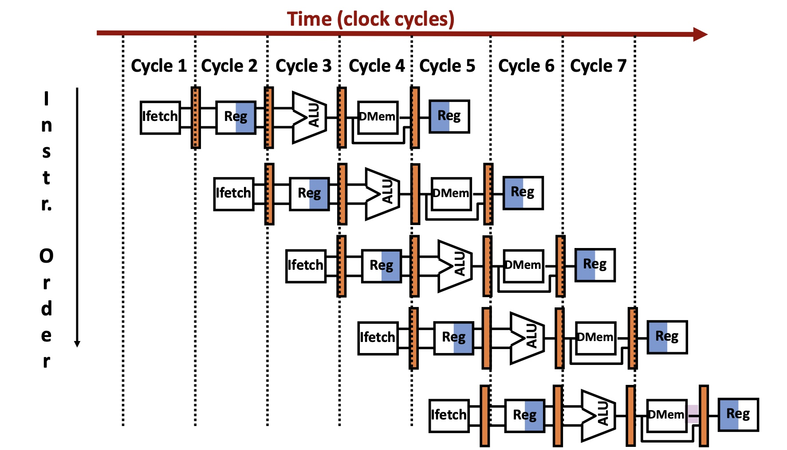

❓Which are potential problems with the pipeline?

A. Two instructions are trying to use the same memory unit at the same time.

B. One instruction needs the results from the previous instruction to complete its computation.

C. One instruction is a jump and the instructions after it do not execute at that time.

D. The current instruction caused an exception and the remaining instructions are invalid.

E. All of the above.


🤔E. All of the above.

---

Visualizing Pipelining - 2nd way:

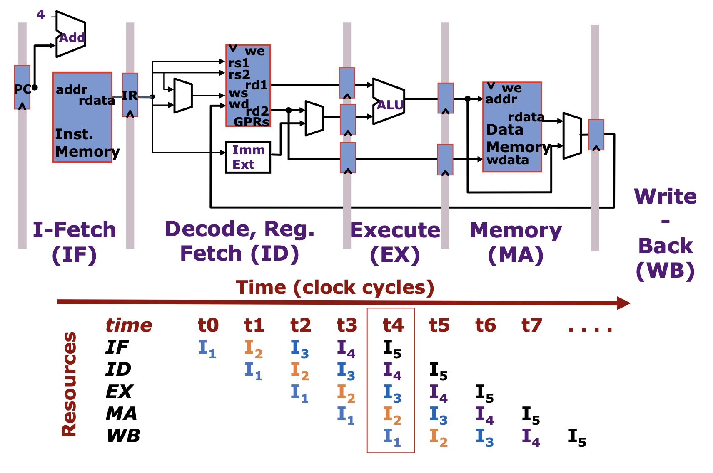

# CPI comparsion between different machines

Bus-based machine / Unpipelined n-stage machine / Pipelined machine

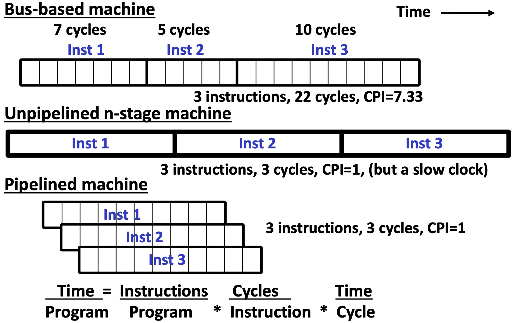

Speedup calculation for Instruction Pipeline: see slide 14.

# Hazards

* Instructions interact with each other in pipeline
* Hazards prevent next instruction from executing during its designated clock cycle

* Issues:
  * How to detect?
  * How to minimize the penalty?

## Structural Hazards

An instruction in the pipeline may need a resource being used by a previous instruction in the pipeline (e.g., address calculation for one instruction using the same adder used for addition in another instruction).

❓Give another example of a structural hazard.

🤔Data and instruction are stored in the same memory. When they are accessed at the same time, then structural hazard will happen.

---

One Memory Port Example (See slide 16-17)

Several questions:

❓Why is the first instruction here a LOAD?

🤔Each instruction can be executed at first, as long as the user want...

---

❓How can this be detected?

🤔Something like lock? One time only one people can access something. If we want to detect it before executing, maybe it is compiler's responsibility.

---

❓What can be done? Should the clock be stopped for one cycle?

🤔Install some bubbles or just wait for one extra cycle.

---

❓How can this hazard be avoided?

🤔Optimize the instruction's order? And a more direct way is to add more hardware support.

---

### Resolving Structural Hazards

* Structural hazards occurs when two instruction need same hardware resource at same time
  * Can resolve in hardware by stalling newer instruction till older instruction finishes with resource
* A structural hazard can always be avoided by adding more hardware to design
  * E.g., if two instructions both need a port to memory at same time, could avoid hazard by adding second port to memory
* Our 5-stage pipe has no structural hazards by design


## Data hazards

Instruction depends on (data) result of prior instruction still in the pipeline.


There are three generic data hazards:
1. RAW (Read after write)
2. WAR (Write after read)
3. WAW (write after write)

### 1st Generic Data Hazard - RAW

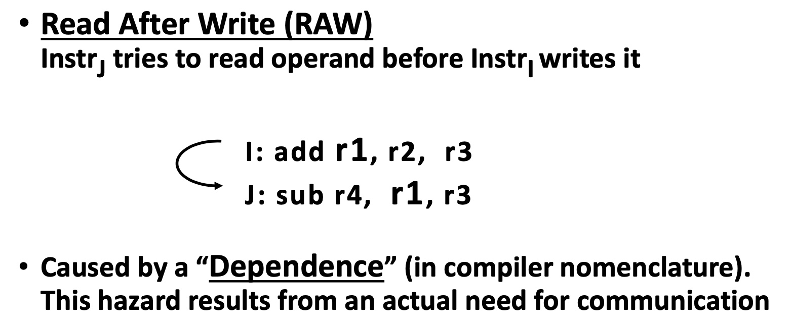

 
Data Hazard on R1:

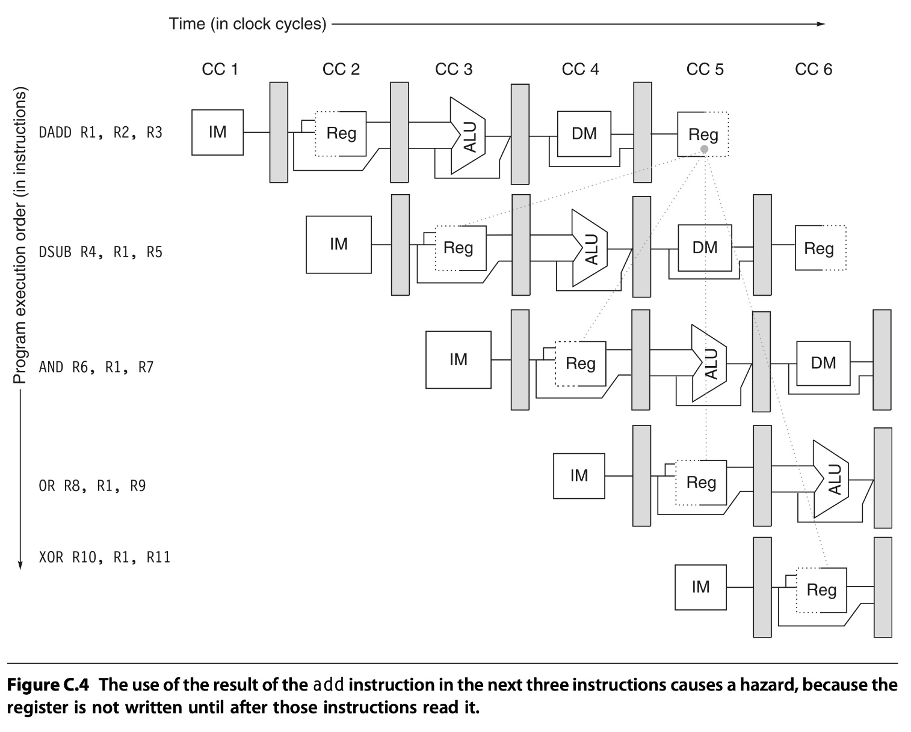

❓How many stalls for SUB?

🤔2 stalls.

---

❓How can penalty be reduced?

🤔forwarding? re-order?

### 2nd Generic Data Hazard - WAR

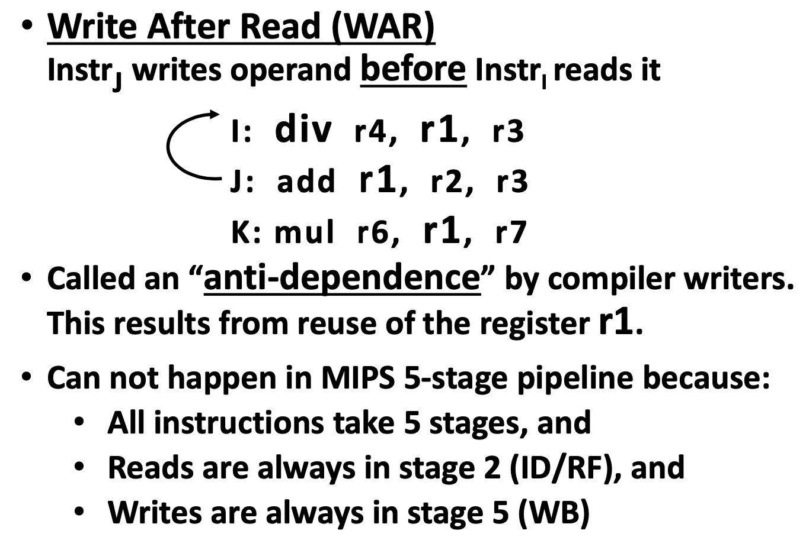

### 3rd Generic Data Hazard - WAW

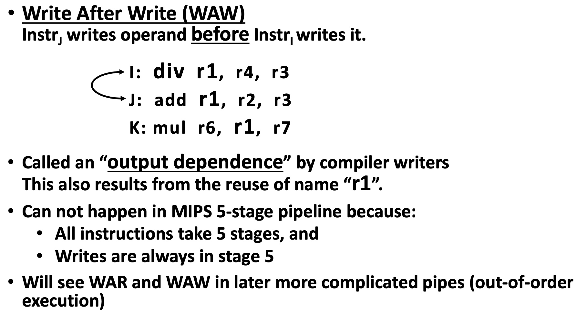

## Control hazards

Branches and jumps

## Interrupts/exceptions

/

PS: I feel sleepy when I listened the lectures so I didn't follow really well.

