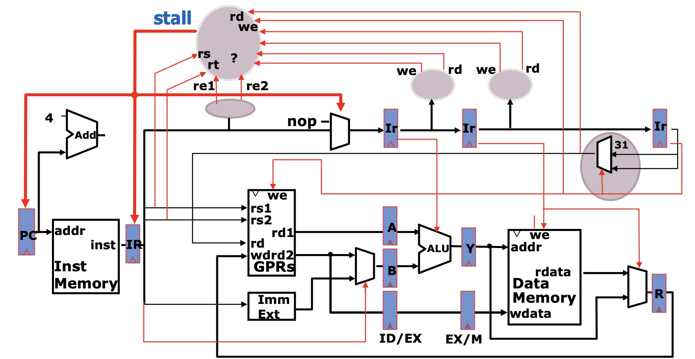
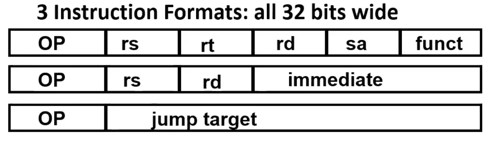
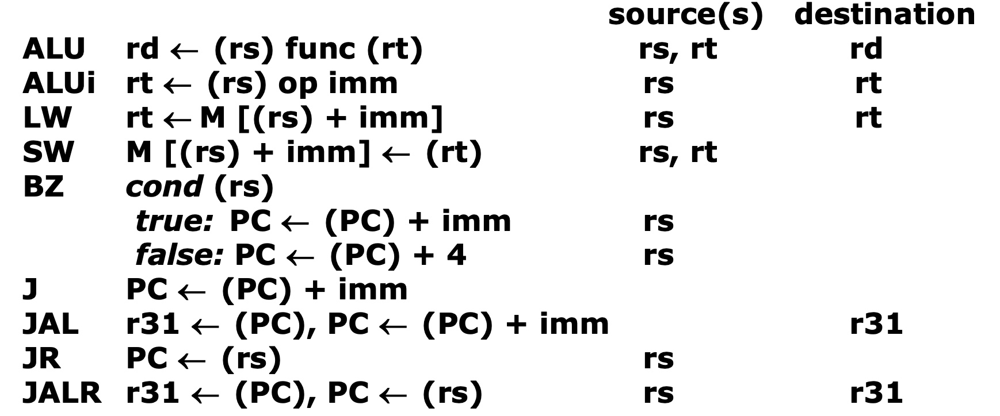
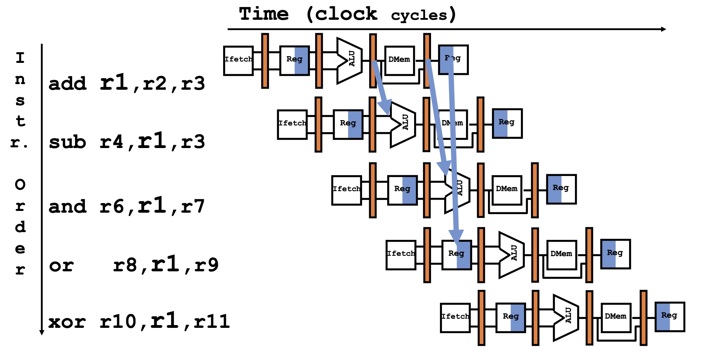
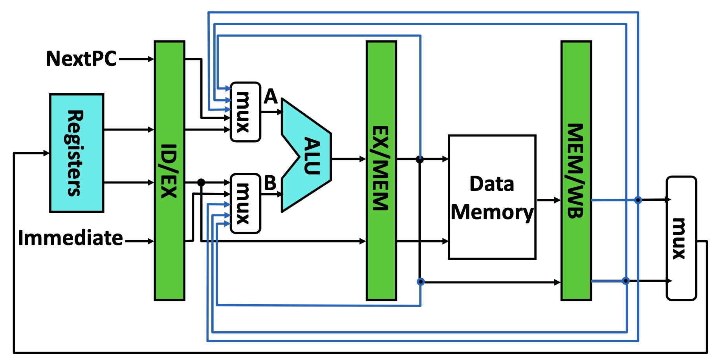
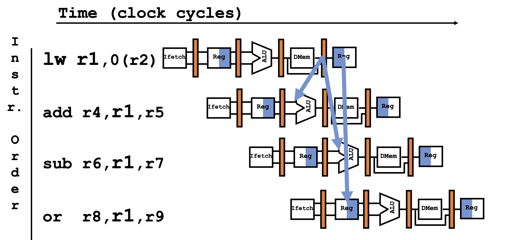
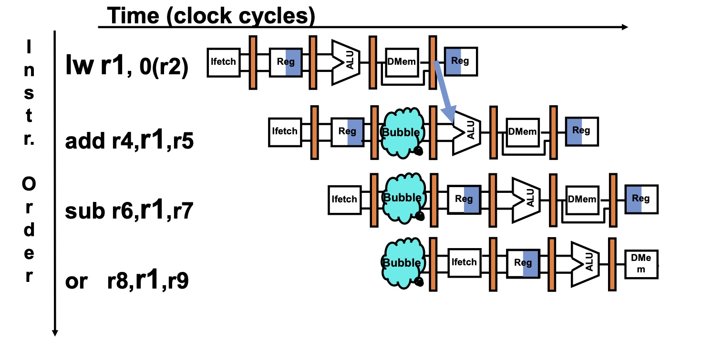
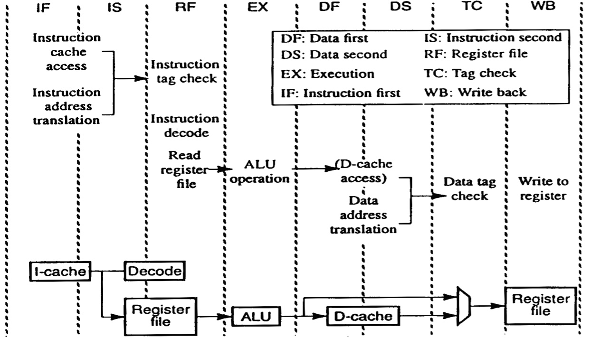
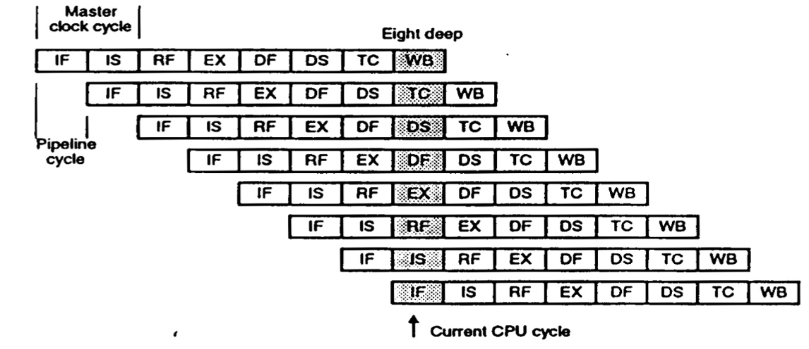
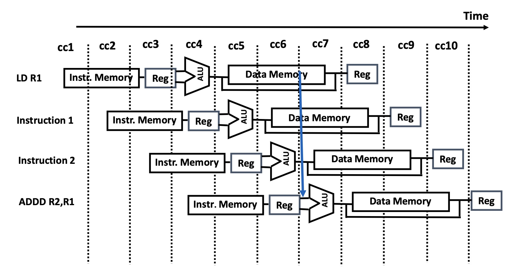

# Lesson6 Pipeline Data Hazards

[TOC]

## Objectives &  Prior Learning

* Analyze types of data hazards
* Explore MIPS instruction pipeline
* Explore three generic data hazards
* Explore methods for dealing with data hazards


Patterson, Chapter 3 and Appendix C
* Pipeline stages
* Datapath with pipelines and latches
* Cycles per instruction calculations using pipelines 
* Instruction pipeline hazards


# Data Hazards

## How to deal with it?

Must first detect:
1. Introduce stalls (bubbles)
  * Capability to stall instructions and then release when it becomes safe to do so
2. Internal data forwarding
3. Reschedule instructions
  * Static rescheduling - by the compiler
  * Dynamic rescheduling - by the hardware
4. A combination of the above


## How to detect it? - register

### Interlock Control Logic



Compare source registers of instruction in ID to destination register of previous instructions. Should we always stall if the rs field matches some rd? Not every instruction writes a register ⇒ we or reads ⇒ re

### Possible Source & Destination Registers

instruction types and their formats:






❓What is the purpose of r31?

🤔Temporary store the PC, and when the instruction wants to jump back, restore it from r31. I think it's for function stack?

## Load & Store Hazards

Detecting the data hazards in memory is much harder!

However, the hazard is avoided because our memory system completes writes in one cycle.


# forwarding


## To Avoid RAW Data Hazard



##  HW Change for Forwarding




❓Why are there two forwarding paths (32 bits each) to both ALU inputs?


🤔For two source registers. Either of them will use the output of previous ALU.

---

❓Why are there two additional paths from MEM/WB?

🤔I think the upper one is the data from memory and the bottom one is to check whether it is a load instruction or a store instruction.

## Other problems

**Data Hazard Even with Forwarding**




❓Can another forwarding path be added?

🤔No.

---

❓Which instructions can be fixed by forwarding when they follow `lw r1, 5(r3)` in
the given order?

```assembly
add r4,r1,r5 
sub r6,r1,r7 
or r8,r1,r9
```

🤔The second one and third one.


We can add a bubble to deal with this kind of situation:




## Detecting Pipeline Data Hazards After LW

see slide 14 for more info

* No dependence
* Dependence requiring stall
* Dependence overcome by forwarding
* Dependence with accesses in order


# Advanced Pipeline Example: MIPS R4000

👧They divide the instructions into 8 stages. And please note the "tag check".





RAW Hazard:



# Pipelining with Stalls - calculations

```
CPI_{pipelined} = CPI_{ideal} + Average Stall cycles per Inst

Speedup = Pipeline depth * (Cycle Time_{unpipelined} / Cycle Time_{pipelined}) * (CPI_{ideal} / (CPI_{ideal} + Avg.stall CPI))

For simple RISC pipeline, CPl_{ideal} = 1:

Speedup = (Pipeline depth / (1 + Average stall CPI Cycle Time)) * (Cycle Time_{unpipelined} / Cycle Time_{pipelined}) 

```

**Benefits of Forwarding (All Instructions)**

see a calculation in slide 19 