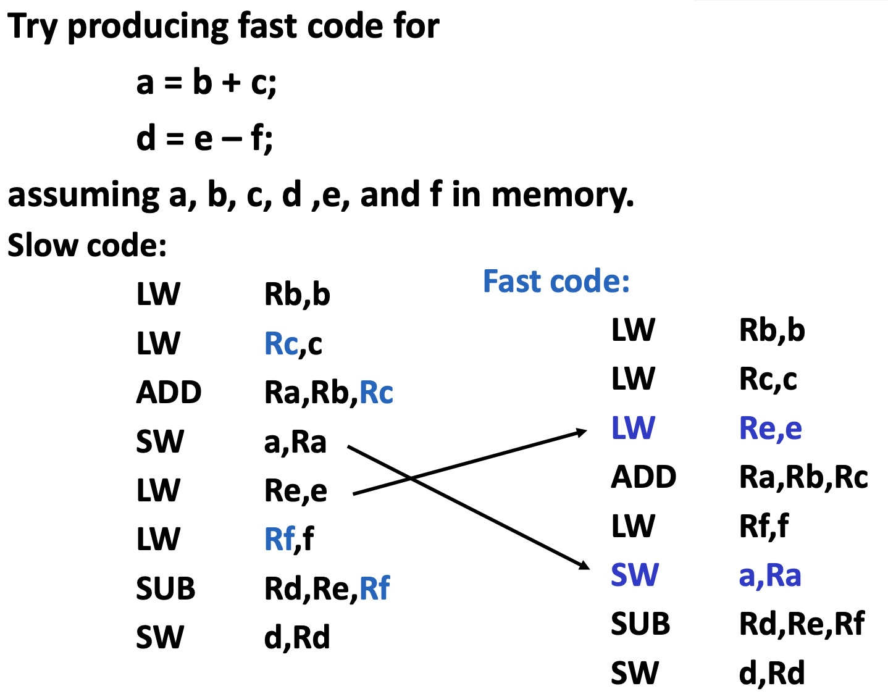
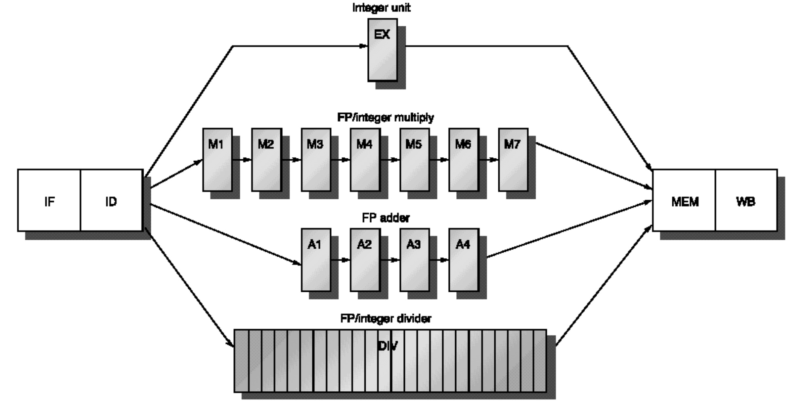
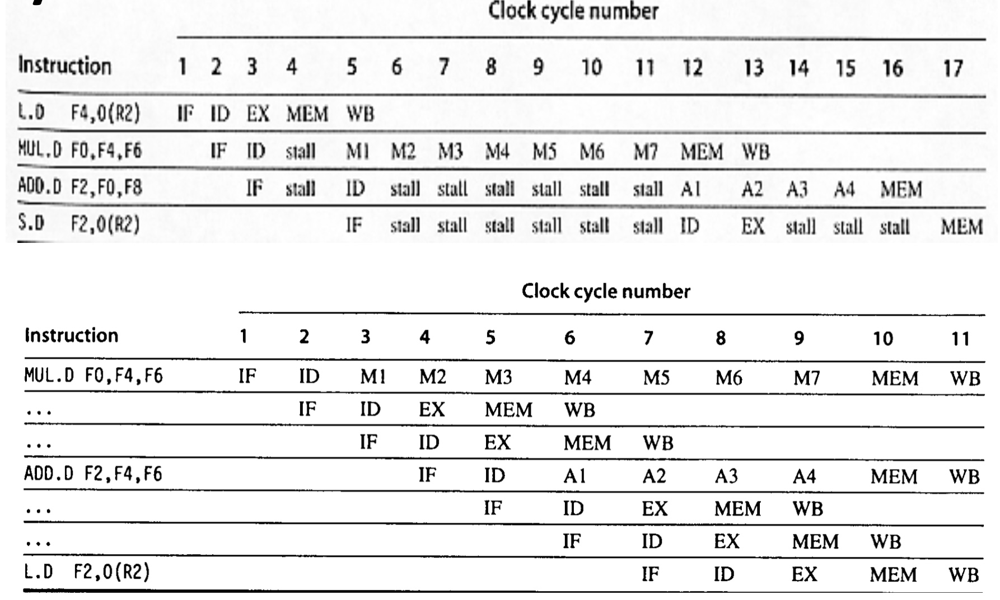
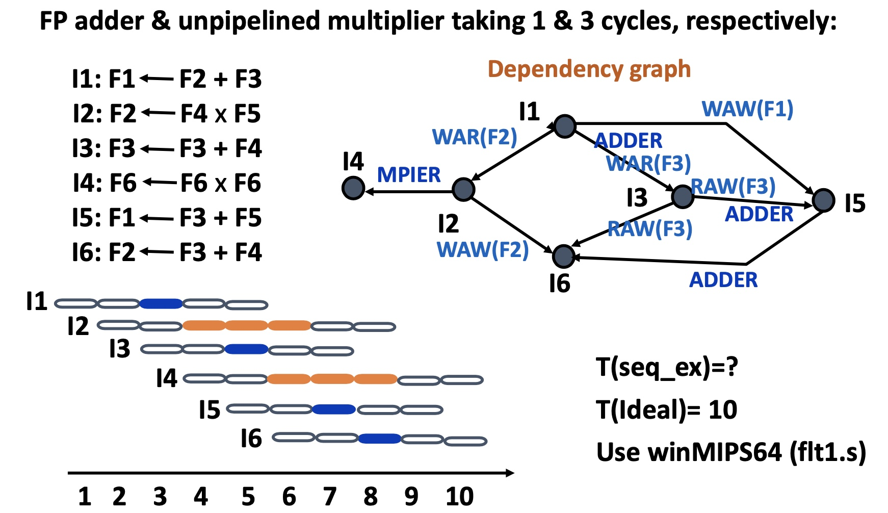
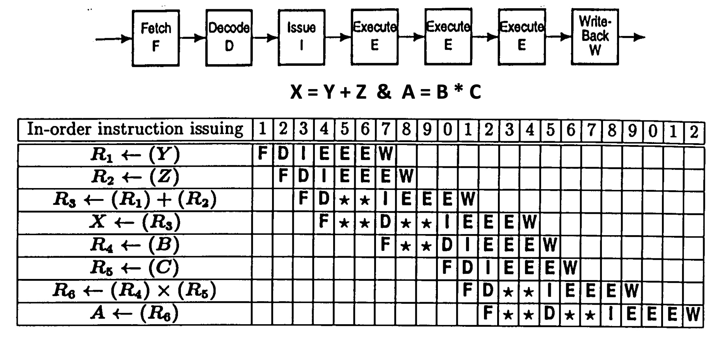
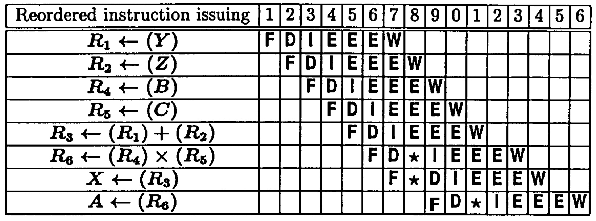
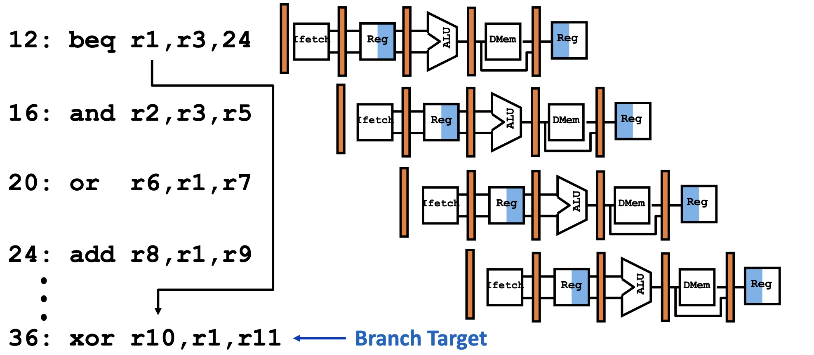
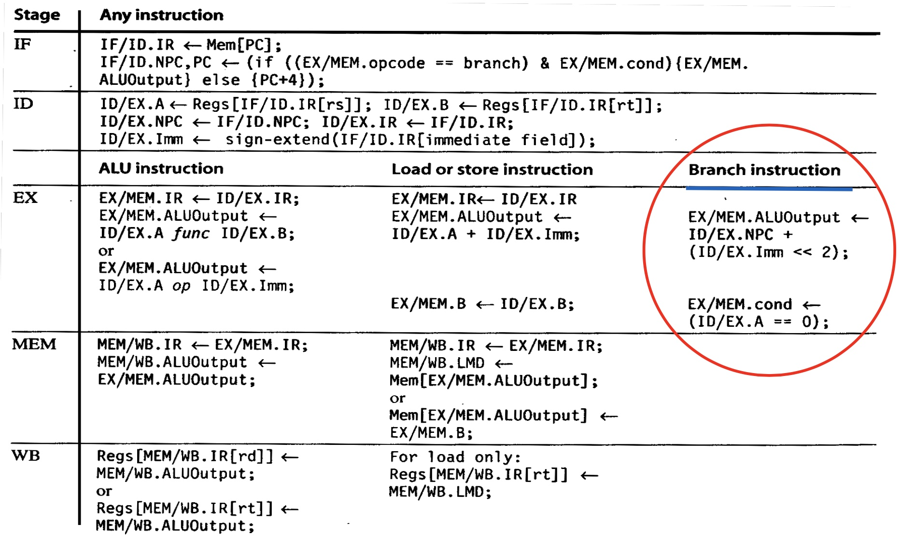
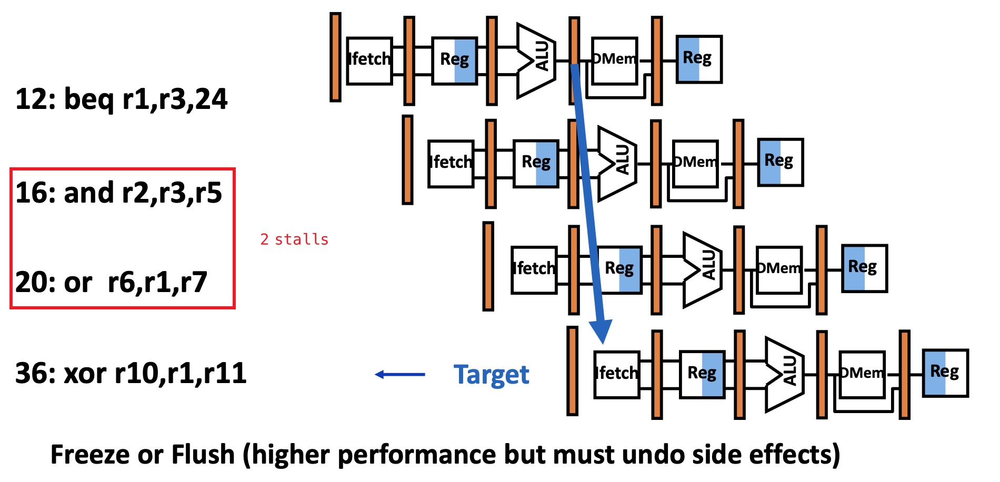
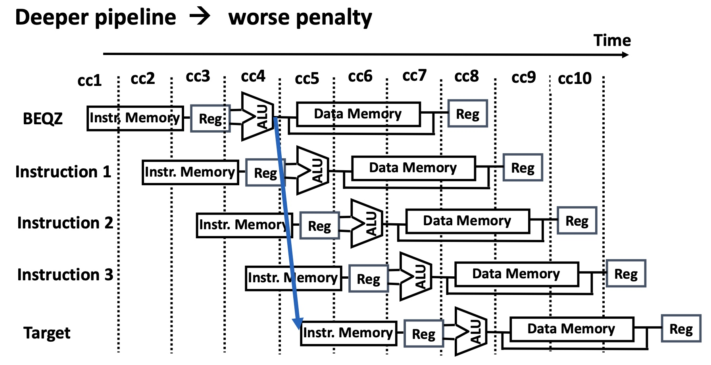

# Lesson 7 Software Scheduling, Multi-cycle Operation, and Control Hazards

[TOC]

## Objectives &  Prior Learning

* Analyze benefits of forwarding
* Explore software scheduling to avoid load hazards
* Demonstrate understanding of multi-cycle operation and hazards 
* Explore winMIPS64 software
* Analyze process of static scheduling
* Analyze issues related to branch MIPS


Patterson, Chapter 3 and Appendix C
* Dealing with data hazards by introducing stalls and by forwarding
* Forwarding hardware

---

❓How can the programmer or compiler write instructions so to reduce the number of stall insertions?

🤔Make the adjacent instructions less dependent. Also can re-order the instructions without changing the program results.

## Software Scheduling

Re-order the codes to Avoid Load Hazards:



❓In the original (slow) code, what are the stalls (due to data hazards)?

🤔2 stalls if forwarding is used.

---

❓Will SW after ADD cause the stall?

🤔No.


##  Multi-Cycle Operation

### Basics

Floating-point operations can not complete in 1 cycle.

```
Assume: 

OP.    #cycles 
Int.op  1 
FP.Add  4 
FP.Mult 7 
FP.Div  24
```



❓Why would we not design the divider as a pipeline?

🤔Maybe the data dependency?

### Hazards



❓Why the stall in Cycle 16?

🤔Since the previous instruction is on the MEM stage and only one access to MEM for one time.

---

❓In the second example, how to detect and handle cycle 10 and 11, that is, multiple access to memory and write back to registers?

---

Dependency graph:




### Software Static Scheduling

old:


new:


* 16 vs. 22 cycles
* Cheap to implement
* May need NOPs
* Source: J. Smith, IEEE Computer, July 1989.

❓How many cycles will be needed without hazards?

🤔14 cycles?

---

## WINMIPS64 Software

See slide 11-12.

## Control Hazards on Branches

### Branch Instructions



❓Why 24?

🤔24=36-12. But I think the minus should be taken for next PC?

---

❓What will be the final offset in the binary instruction?

🤔36-16=20 20/4=5 => 00101

---

How to calculate the offset:



### Control Hazard




### Branch Stall Impact - MIPS R4000 



Deeper pipeline -> worse penalty


Slide 19-20: calculation examples of CPI due to the branch stalls (Conditional and Unconditional Branch)