# Lesson 9 Dynamic Scheduling with Scoreboards

[TOC]

## Objectives &  Prior Learning
* Explore advantages of dynamic scheduling
* Evaluate the use of scoreboards for dynamic scheduling 
* Analyze scoreboard architecture and stages of control

Patterson, Chapter 3 and Appendix C 
* Modified MIPS pipeline
* Four branch hazards alternatives
* Stall until direction is known 
* Static prediction
* Delayed branch
* Dynamic branch prediction

## Dynamic Scheduling

### Advantages
* Handles cases when dependencies unknown at compile time
* Simplifies the compiler
* Allows code that compiled for one pipeline to run efficiently on a different pipeline
* Hardware speculation, a technique with significant performance advantages, builds on dynamic scheduling
* Key idea: Allow instructions behind stall to proceed
* Enables out-of-order execution & out-of-order completion

### Examples

**Allow Instructions Behind Stall to Proceed**

```
fdiv.d f0,f2,f4 
fadd.d f10,f0,f8 
fsub.d f12,f8,f14
```
The `fadd.d` needs to wait for the slow `fdiv.d` to produce `f0` but the `fsub.d` can proceed.

---

**HW Speculation**

```
      ADD R1,R2,R3 
      BEQZ R5 Next 
      ...
Next: SUB R7,R6,R4
```

Predict the outcome of a branch and start executing instructions accordingly.

## Scoreboard: a Bookkeeping Technique

* Scoreboards date to CDC 6600 in 1963
* Instructions execute whenever not dependent on previous instructions and no structural hazards
* CDC 6600: In order issue, out-of-order execution, out-of-order commit (or completion)
  * No forwarding (in original implementation)
  * But can be added
* Out-of-order execution divides ID stage:
1. Issue — decode instructions, check for structural hazards
2. Read operands — wait until no data hazards, then read operands


### Scoreboard Architecture (CDC 6600)

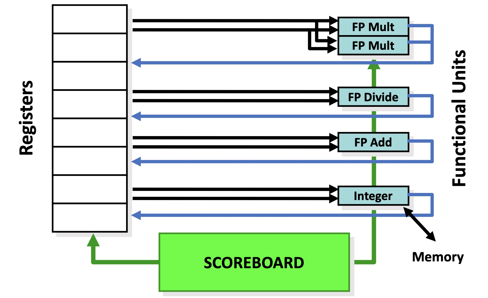

### Scoreboard Implications

* Out-of-order completion => WAR, WAW hazards
* Solution for WAR:
  * Stall writeback until registers have been read
* Solution for WAW:
  * Detect hazard and stall issue of new instruction until other instruction completes
* Need to have multiple instructions in execution phase => multiple execution units or pipelined execution units
* **Scoreboard** keeps track of dependencies between instructions that have already issued
* Check slide 11 for an example

### Four Steps of Scoreboard Control

* Scoreboard replaces ID, EX, WB with 4 steps
* **Issue** — decode instructions & check for structural hazards (ID1)
  * Instructions issued in program order (for hazard checking)
  * Don’t issue if structural hazard
  * Don’t issue if instruction is output dependent on any previously issued but uncompleted instruction (no WAW hazards)
* **Read operands** — wait until no data hazards, then read operands (ID2)
  * All real dependencies (RAW hazards) resolved in this step, since we wait for instructions to write back data.
  * **No forwarding of data in this design**
* **Execution** — operate on operands (EX)
  * The functional unit begins execution upon receiving operands. When the result is ready, it **notifies the scoreboard** that it has completed execution.
* **Write result** — finish execution (WB)
  * Stall until no WAR hazards with previous instructions:

    ```
    DIVD F0,F2,F4 
    ADDD F10,F0,F8 
    SUBD F8,F6,F14
    ```
  * CDC 6600 scoreboard would stall SUBD until ADDD reads operands.

### Three Parts of the Scoreboard

* **Instruction status**: Which of 4 steps the instruction is in
* **Functional unit status**: Indicates the state of the functional unit (FU). 9 fields for each functional unit
  * Busy: Indicates whether the unit is busy or not
  * Op: Operation to perform in the unit (e.g., ADD or SUB) 
  * Fi: Destination register
  * Fj,Fk: Source-register numbers
  * Rj,Rk: Flags indicating when Fj, Fk are ready
  * Qj,Qk: Functional units producing source registers Fj, Fk
* **Register result status**: Indicates which functional unit will write each register, if such FU exists. Blank when no pending instructions will write that register

### How is it done?

Central control keeps track of
1. Current step of each instruction (out of 4 steps: Issue, Get operands, Execute, Write);
2. Status of functional unit: to keep track of RAW & structural hazards (if busy):
   * Rj, Rk - status of source registers (Yes means ready); a No in Rj means must wait for a FU to produce a new value for the source operand
   * Qj will include the ID of the FU that will provide the operand
3. Status of each register Rn: if equal zero, Rn has a “stable” value that is not about to change, otherwise status of Rn includes the ID of the FU that will write into Rn. The register result status allows checking for WAW & RAW. Note that an FU should not have an ID=0.

### Scoreboard Example

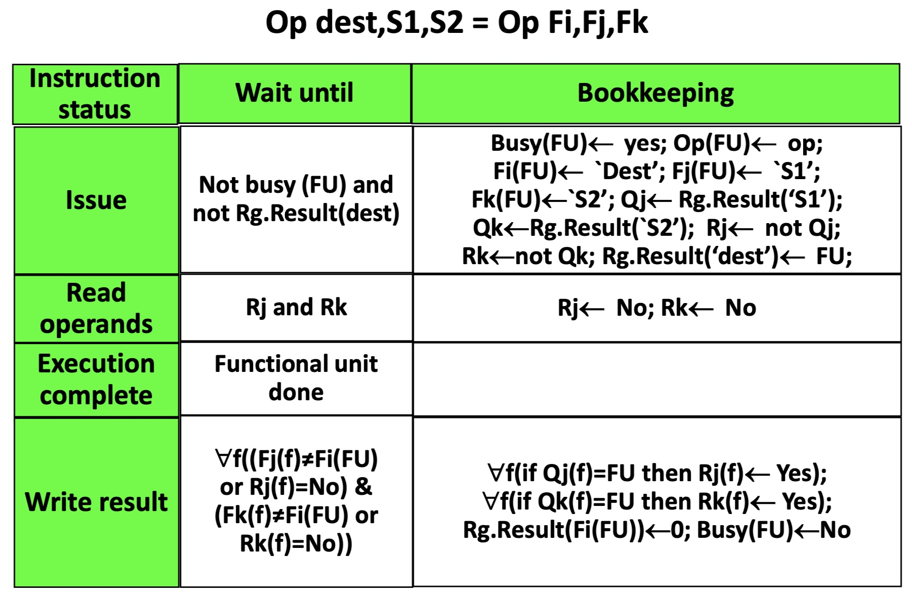


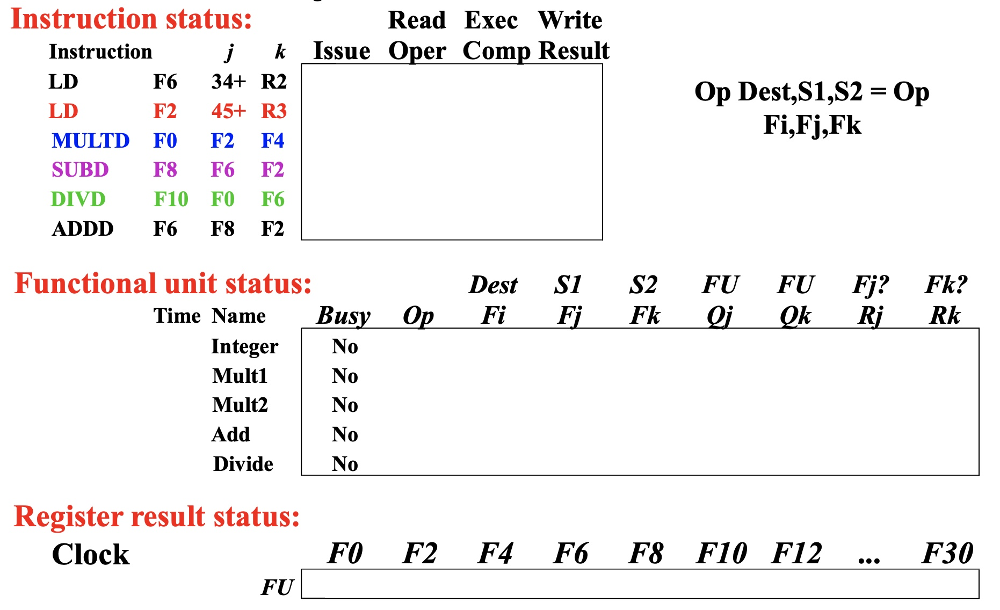


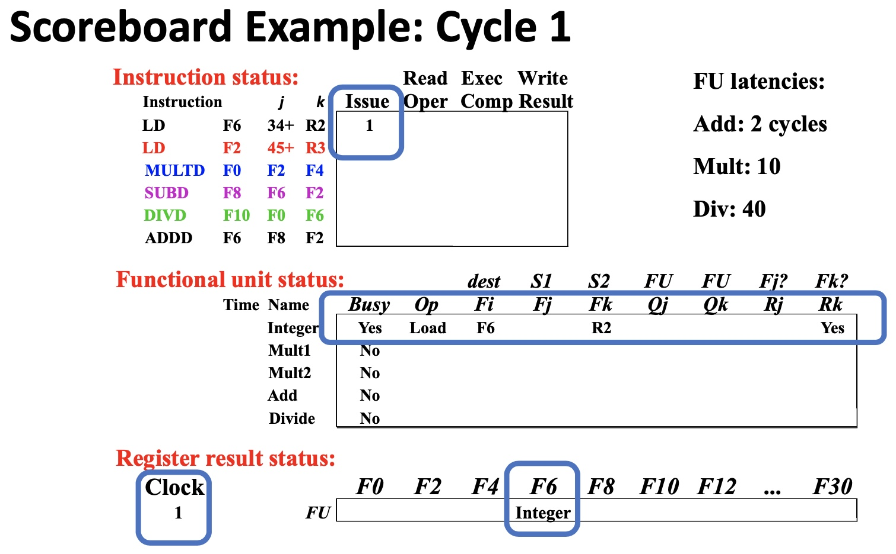

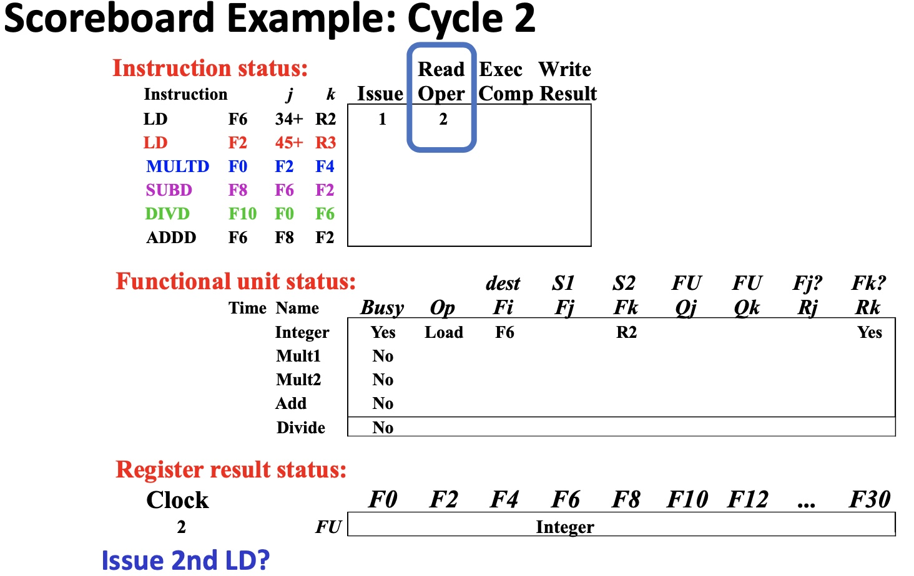

❓Issue 2nd LD?

👨‍🏫No! Since load needs Integer FU, but it is being used by previous load.

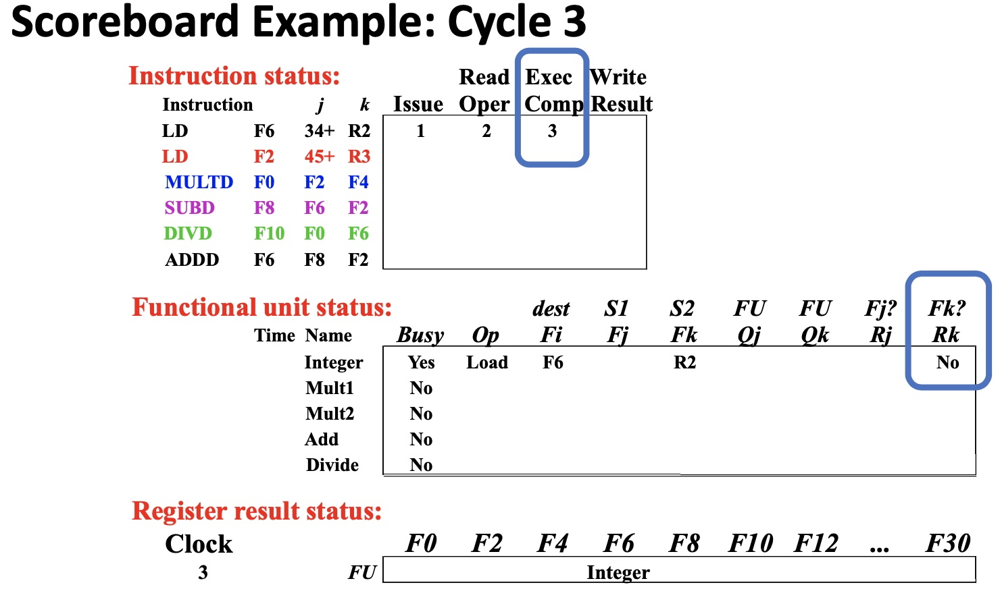

❓Can we instead issue the MULTD? Why or why not?

👨‍🏫No! But why?

🤔Since MULTD needs data from previous load F2. Data hazard.

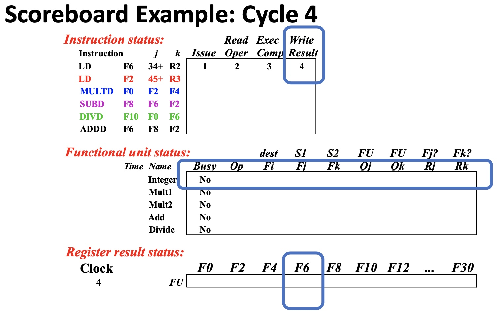

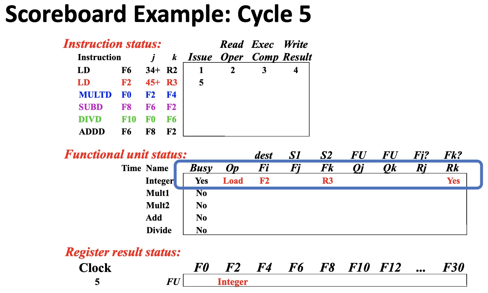

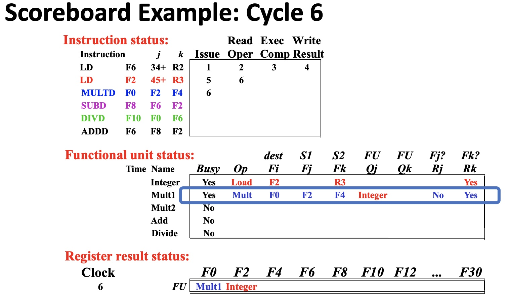

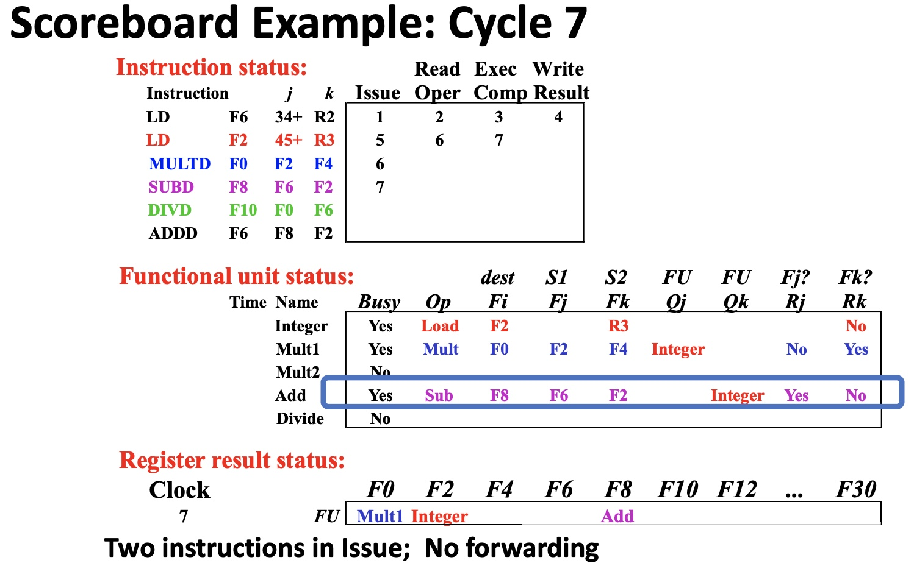

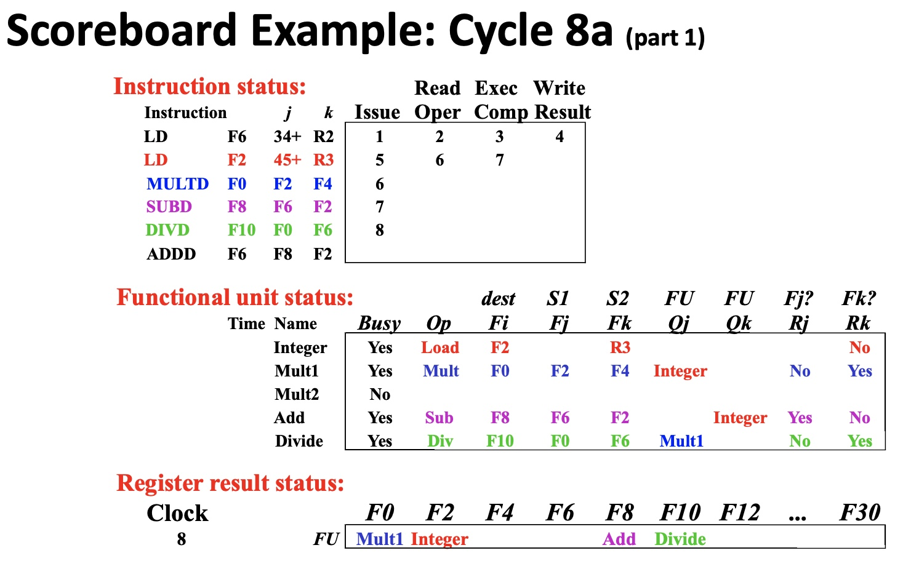

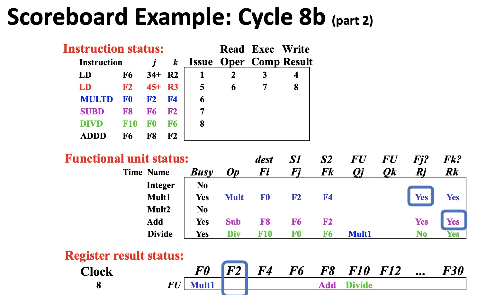

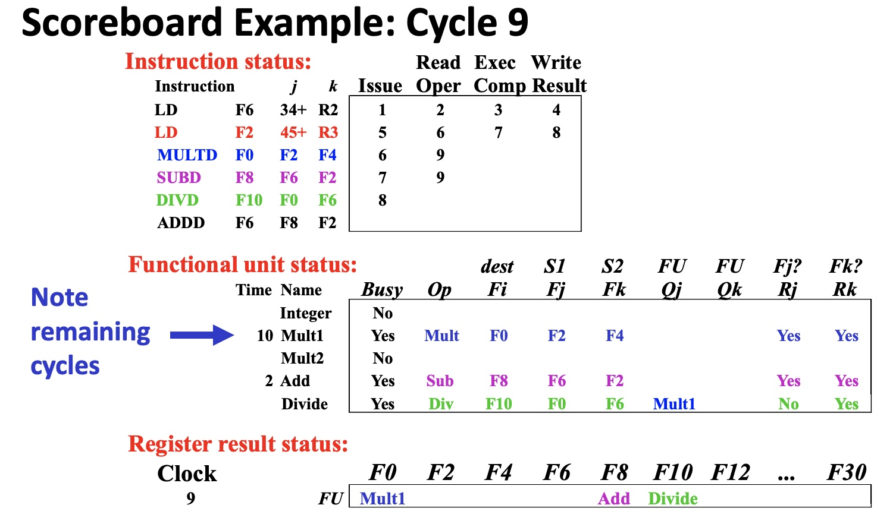

❓Can we instead read operands for MULT & SUB?

🤔A confusing question since in cycle 9, we are reading operands for MULT & SUB.

👨‍🏫Seems like professor is also confused about it. 

---

❓Issue ADDD?

🤔No, since the Add FU is being occupied.

👨‍🏫Right.

---

。。。

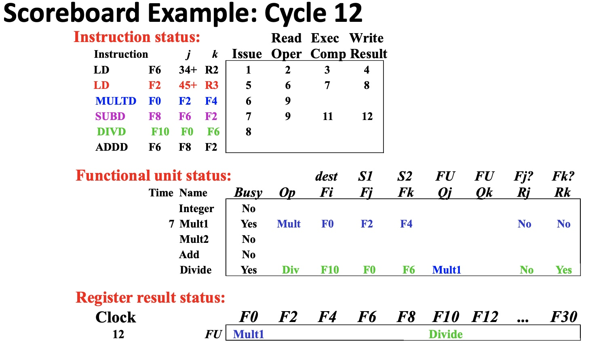

❓Where is cycle 10? Why don't execute MULTD? And why its Rj and Rk become No?

🤔I forget one important thing, some operations have high FU latencies. Load just needs 1 cycle, but Add needs 2 cycles. 10 cycles for Mult and 40 cycles for Div.

---

❓Can we instead read operands for DIVD?

🤔No. It needs F0 which is the result of MULTD. 

---

❓Issue ADDD?

🤔Yes. Since SUBD has completed.

。。。

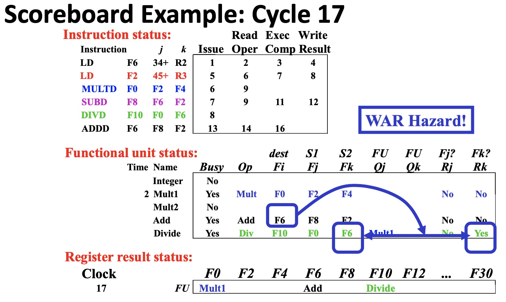

❓Why not write the result of ADDD?

🤔There is a WAR Hazard.

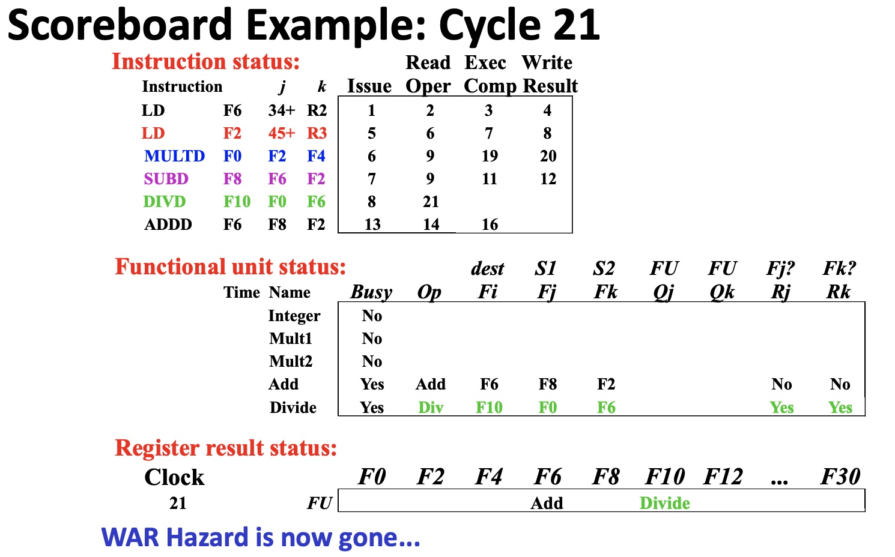

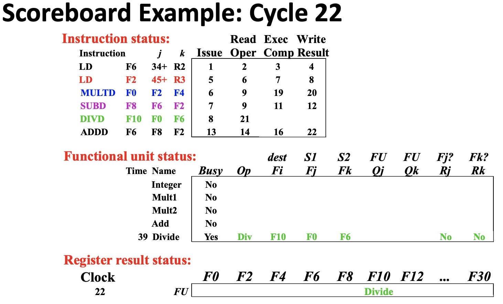

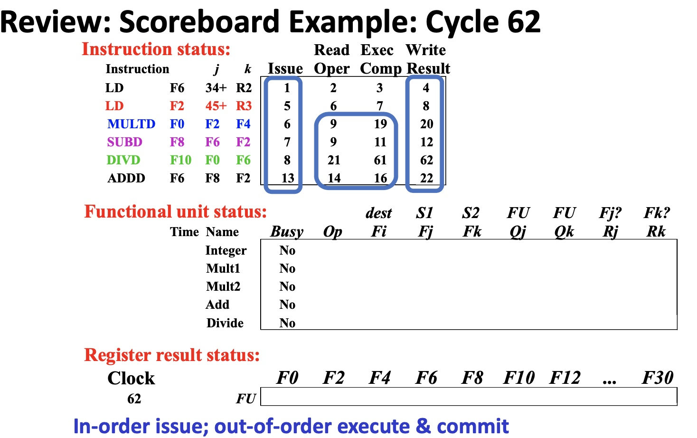

### CDC 6600 Scoreboard - Summary

Key idea of Scoreboard: Allow instructions behind stall to proceed (Decode ⇒ Issue instruction & read operands)
* Enables out-of-order execution ⇒ out-of-order completion
* ID stage checked both for structural & data dependencies
* Original version didn’t handle forwarding
* Limited to instructions in basic block (small window)
* Prevent WAW hazards, but wait for WAR hazards