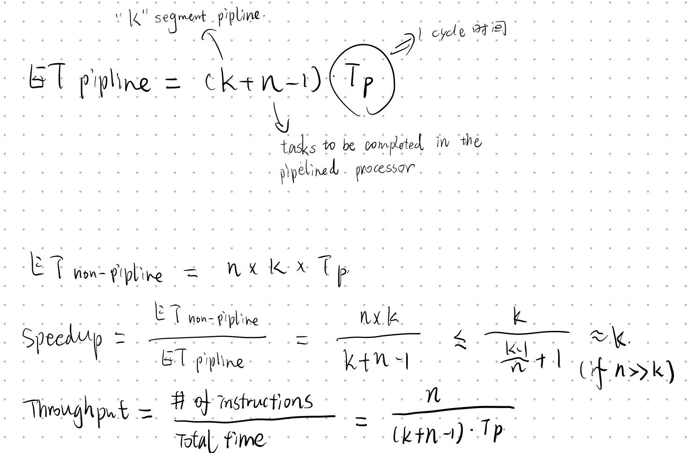

昨天 quiz 成绩出来了，勉强及格 🤣，Moodle 给我了个评语 “Need more effort for the future Quizzes!”，扎心了！下面记录一下有点疑惑的题目。

The second question, "Instruction level parallelism is the degree to which multiple instructions can be processed by a processor, but not necessarily in the same execution unit." This statement is wrong.

**wiki:** Instruction-level parallelism (ILP) is a measure of how many of the instructions in a computer program can be executed simultaneously.

👧I actually think wiki's explanation is on the same page with the statement "the degree to which multiple instructions can be processed by a processor". Besides, the latter part of a sentence is also correct since superscalar execution has multiple execution units.

Therefore, I don't know where I wrong in this question. I may discuss with professor afterwards.

(2020-09-07 update) Professor told me I am right.

---

👧The answer of question 3 is 1.212, which is impossible since it is larger than 1. ~~Need further confirmation.~~

---

👧The answer of question 6 is 701.86, which is not reasonable for CPI (cycles per instruction). ~~Need further confirmation.~~

---

❓A given processor has a 16-stage pipeline. Each stage of the pipeline takes 6.6  microseconds to execute. What will be the ideal Throughput of this pipeline? (Express in Instructions per second).

🤔Here are the formulas for throughput calculation:

But in this case, we can't use the formula since the question asks for the ideal case, which means k << n. In this case, the throughput is `1/T = 1/(6.6*10^(-6))=151515.151515152`.

---

❓Suppose that the overall speedup for a program containing 51% divide operations is 4.9 when we replace the old divider by a new one that is n times faster. What is n? Round to two decimal places.

🤔A simple question but get a impossible answer. `1/((1-0.51)+0.51/n)=4.9` -> `n=-1.78`. But the correct answer is `1.016`. I have no idea about the answer. ~~Need further discussion.~~

(2020-09-07 update) Professor told me I am right.

---

❓Suppose that a new fast divider costs 17 times as much as the old divider. Assume that the old divider constitutes 51% of the total processor cost. Given that the old processor cost was $9.2, what is the new cost with the new divider? Round to three decimal places.

🤔Only `9.2*0.51*17` cannot solve this problem. Please understand the new cost means the processor's cost. Calculate `9.2*0.49+9.2*0.51*17` instead.

---

PS: I found that it was not the professor's problem to get some ridiculous answer, since everyone gets the same question with different numbers. So I guess maybe the numbers are randomly generated and this make sense. No need for further confirmation any more.