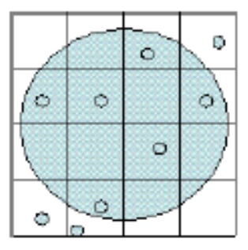

看到错的个数，风中凌乱，开始怀疑人生🤨

❓Suppose that the overall speedup for a program containing 76% divide operations is 6.7 when we replace the old divider by a new one that is n times faster. What is n? Round to two decimal places.

🤔Still the same problem as quiz1. I think it is a bug. My answer is -8.37, but the correct answer is 1.011.

(2020-09-07 update) Professor told me I am right.

---

❓What is the IC cost for the wafer shown below given that the Wafer cost is $3.83, the testing cost is $0.59, the packaging cost is $0.03 and the final test yield is 0.68? Assume that there are no test dies. The small circles indicate defects. Round to two decimal places.

🤔Die cost = Wafer cost / (Dies per Wafer * Die Yield) = 3.83 / (4*1/2) = 1.915

IC cost = (Die cost + Testing cost + Packaging cost) / Final test yield = 3.73

My fault is that I was confused about whether to count the ones with part of it inside the circle. Actually, they shouldn't be counted since they are not complete.

---

❓Given are two statements:

 STATEMENT 1: The use of an optimizing compiler can affect the MIPS rating of a processor, for a given benchmark.

 STATEMENT 2: The MIPS rating of a processor for a given benchmark depends on the compiler used.

🤔Both statements are true. The answer's explanation is that:

> Compilers may change the machine instructions and can reduce the number of stall cycles in the program, thus enhancing the performance. It is common practice to list the MIPS rating with and without the use of an optimizing compiler. Compilers can reduce the number of stall cycles or use different machine instructions to be executed.

But my claim is the definition of "depends on". I think it has the meaning of "only". Anyway, I agree that compiler will influence the MIPS rating.

(2020-09-07 update) Professor said: “depends on” does not mean ”only”, but “one out of so many”, although there might not be any other)! So, both of those statements are correct.