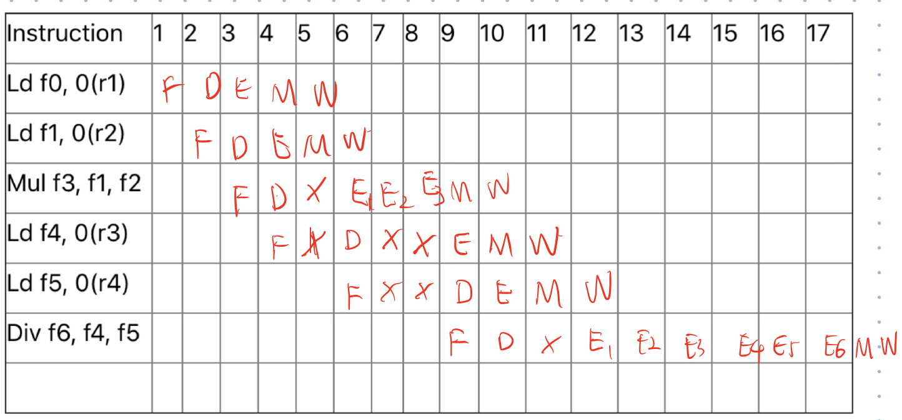
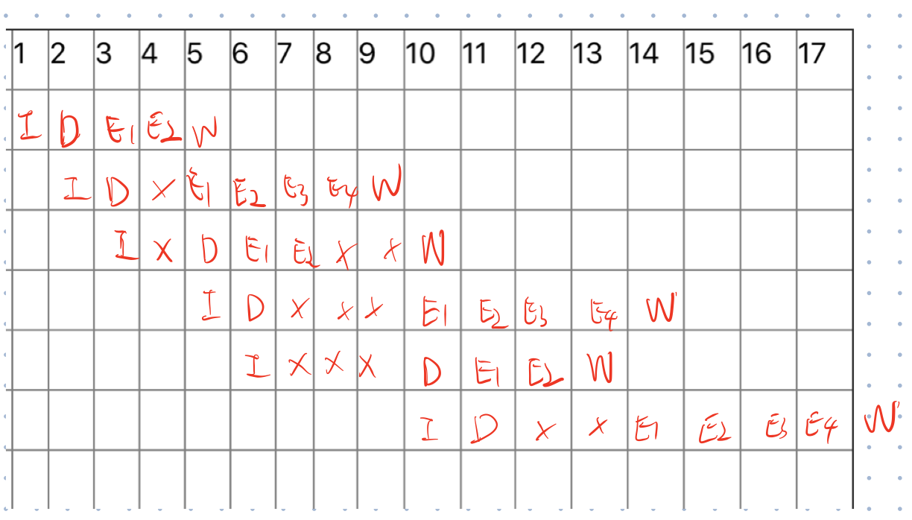
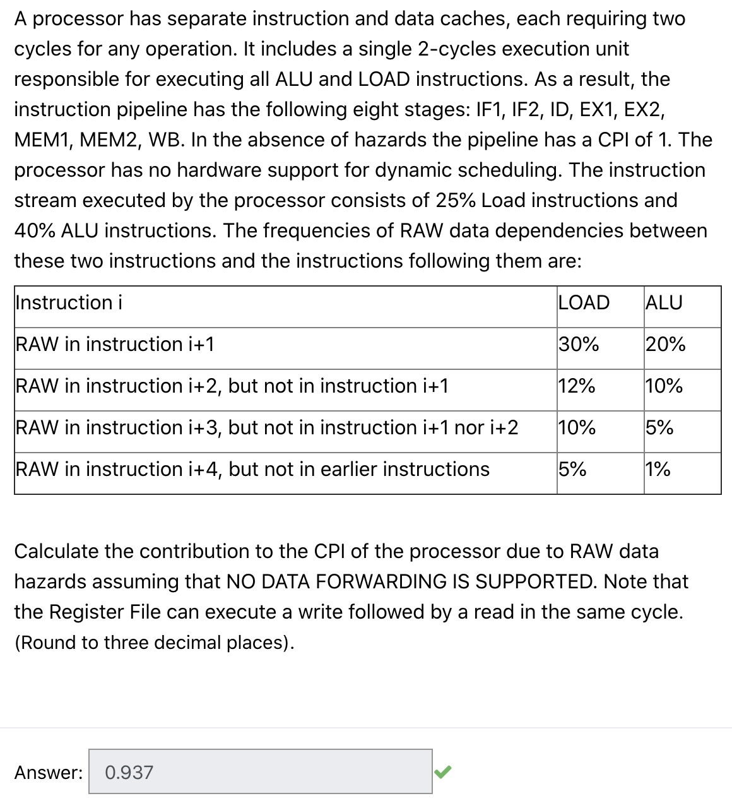

❓Which of the following statements are false for a 5 stage MIPS pipeline with stages: IF, ID, EX, MEM and WB?

a. Store operations are only active (doing something useful) during the IF, ID, EX and WB stages

b. ALU operations are only active (doing something useful) during the IF, ID, EX and WB stages. 

c. Load operations are only active (doing something useful) during the IF, ID, EX and WB stages.

d. Branch operations are only active (doing something useful) during the IF, ID, EX and WB stages. 

👨‍🏫 A & C & D Store and load are also active during the MEM stage. 

* ALU: IF, ID, EX, WB
* Load: IF, ID, EX, MEM, WB
* Store: IF, ID, EX, MEM
* Branch: IF, ID, EX

👧I carelessly chose the right statements and I also thought the branch one is correct since it needs to write the PC register? From the organization diagram, the write back is connected to the register file (general-purpose registers), which is seperated from PC (program status word registers).

---

❓Suppose a program that executes 500 instructions is run using a 8-stage pipeline. In running the program, 105 stall cycles are inserted due to data dependencies. Assuming that the clock period of unpipelined processor is 10% less than the pipelined processor, calculate the Speedup due to pipelining. Round your answer to two decimal places.

🤔My calculation = time_{unpipelined} / time_{pipelined} = `500*8*0.9/(105+(500-1)+8)=5.88`. But the standard answer gives that `Speedup = (Pipeline.Depth / (1+Pipeline.Stall.CPI)) * (CycleTimeunpipelined / CycleTimepipelined) = 8 / (1 + 105/500) * 0.900 = 5.95`. The same argues as quiz3, maybe the speedup calculation shouldn't be so accurate in spite of giving the instruction counts?

---

Question 4:

```
I2: F1 ← F4 * F2
I3: F1 ← F2 + F5
=> I2 → I3 WAW (F1)
```

👧WAW can't happen in MIPS 5-stage pipeline, but I think it's tricky to decide if the question statement is using MIPS architecture.

---

❓Fill in the pipeline diagram (on a separate sheet of paper) for the following sequence of instructions, assuming data forwarding and that multiply takes three cycles to execute and divide takes 6 cycles to execute. How many cycles will it take to execute this instruction sequence? Assume that there is only one execution unit (for example, you cannot multiply and divide at the same time).

👧




So the correct answer is 19 cycles. I am wrong in this question because every time a previous instruction stall, the current instruction should also stall, but I threat it can still execute.

---

❓A given pipelined processor executes floating-point instructions of the type Fi← Fj op Fk. It has an I stage (for instruction fetch) and a D stage (for instruction decode and operand preparation) each taking one clock cycle. The execution phase of a Floating-point ADD operation and a Floating-point Multiply operation takes 2 and 4 cycles, respectively. Each execution is followed by a single (clock) cycle write back (W) into the floating-point register file which can support simultaneous reads but only a single write per cycle. The processor executes the following sequence of floating-point instructions:

```
S1: F2 ← F1 + F4
S2: F3 ← F2 * F4
S3: F3 ← F4 + F5 
S4: F4 ← F1 * F2
S5: F1 ← F2 + F3
S6: F4 ← F1 * F2
```

Assume that the pipelined processor has a single floating-point adder and a single floating-point multiplier. Also assume that the floating-point adder (with execution time of 2 cycles) and the floating-point multiplier (with execution time of 4 cycles) can operate in parallel and are fully pipelined (with a throughput of 1) Show the exact timing for the above program (on a separate sheet of paper) for the case of the basic pipeline with data forwarding. How many cycles will the above program take to run once? 

👧



I got 18 cycles but the correct answer is 14??

---




If forwarding is supported, then the answer is 0.390.

---

❓A particular program consists of 23% ALU instructions (taking 5 cycle each), 21% Load instructions (taking 9 cycles), 19% Store instructions (6 cycles) and the rest Branch instructions (4 cycles). Also assume that while running, the program executes 35% ALU instructions, 11% Load instructions, 18% Store instructions and the rest Branch instructions. What percentage of the time CPU is executing Branch instructions? (Round your answer to 2 decimal places).

👧A simple question, but ask for the percentage! I ignore that. The correct answer is 27.38 but not 0.27.